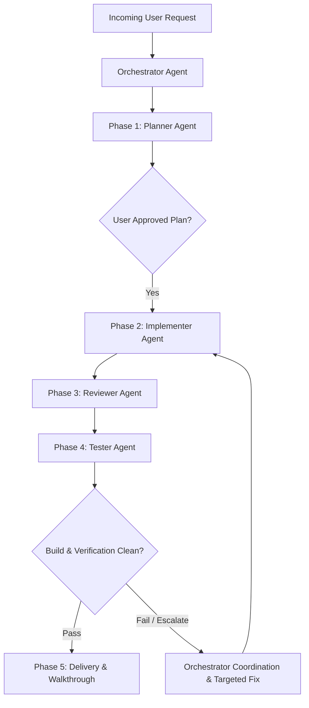

# Agent Skill: Orchestrator

This skill defines the operational workflow, coordination lifecycle, and runtime subagent management directives for the **Orchestrator Agent** in MotoShop.

## 1. Role Objective & Coordination Matrix
The Orchestrator Agent is the primary operational authority on every task, user request, or bug report. It ensures that development strictly adheres to the 5-phase lifecycle and oversees both Tier-1 Phase Agents and Tier-2 Specialist Subagents.



## 2. Runtime Subagent Supervision Protocol
1. **Tier-1 Phase Agent Delegation**:
   - The Orchestrator delegates tasks sequentially to Phase Agents (`agent-planner`, `agent-implementer`, `agent-reviewer`, `agent-tester`).
2. **Authorizing Child Subagent Spawning**:
   - The Orchestrator authorizes Phase Agents to spawn specialized Tier-2 subagents at runtime for targeted execution (e.g. backend vs frontend, security audit vs architectural parity, build testing vs visual testing).
3. **Escalation Resolution**:
   - When a child subagent exhausts its 3-iteration autonomous self-correction loop without resolving an error, it escalates to its parent Phase Agent.
   - If the issue crosses service boundaries or requires architectural changes, the Phase Agent escalates to the Orchestrator.
   - The Orchestrator analyzes the root cause, coordinates sibling subagents, or updates the implementation plan.

## 3. Standardized Subagent Contract Schemas

### A. Subagent Task Brief (Orchestrator / Parent $\to$ Child)
```markdown
### Subagent Task Brief: <subagent_id>
- **Role**: <role_name> (e.g. planner-domain-schema, implementer-backend)
- **Objective**: Exact single-responsibility deliverable
- **File Scope**: Explicit list of allowed file paths (strictly disjoint across concurrent subagents)
- **Active Invariants**: Architecture, security, styling, or session rules
- **Verification Targets**: Build commands, linters, or test assertions required
```

### B. Subagent Deliverable Report (Child $\to$ Orchestrator / Parent)
```markdown
### Subagent Deliverable Report: <subagent_id>
- **Status**: SUCCESS | ESCALATE
- **Modified Files**: List of touched files with diff summaries
- **Verification Performed**: Commands run and test exit codes
- **Self-Correction Log**: Iterations attempted (if compile/lint errors occurred)
- **Identified Risks / Blockers**: Unresolved issues or cross-boundary dependencies
```

## 4. Phase Hand-Off Criteria
- **Phase 1 $\to$ Phase 2**: Implementation plan approved by user.
- **Phase 2 $\to$ Phase 3**: Code written, clean syntax, local builds pass.
- **Phase 3 $\to$ Phase 4**: Code review approved, security & architecture checks pass.
- **Phase 4 $\to$ Phase 5**: Automated build (`npm run build`), API tests, DB persistence, and visual checks pass with exit code 0.
- **Phase 5 Delivery**: Comprehensive `walkthrough.md` generated with diff summaries and verification screenshots.
