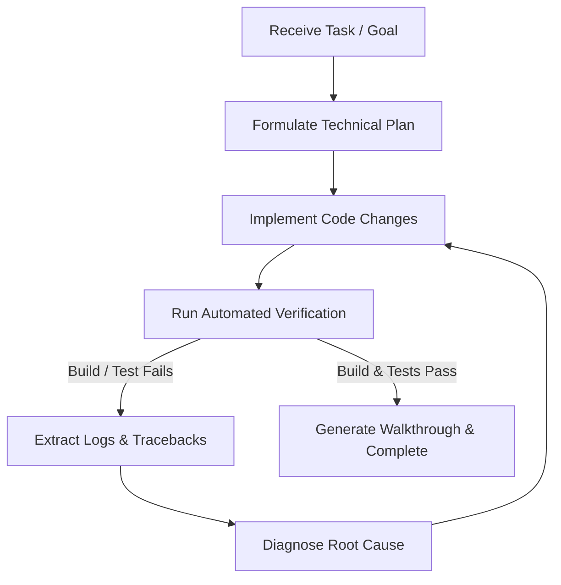

# Autonomous Task Loop Skill

This skill provides instructions for executing tasks using an **Autonomous Iterative Loop Strategy**.

## Core Workflow

## Step-by-Step Execution Guidelines

1. **Plan & Goal Definition**:
   - Define exact quantitative completion criteria (e.g. `npm run build` exit code 0, 0 backend tracebacks).
2. **Implementation**:
   - Apply edits across frontend and backend files preserving existing API contracts.
3. **Automated Verification Loop**:
   - Run compilation and runtime verification commands.
   - If an error occurs:
     - Read the full un-truncated error traceback.
     - Trace upstream models, schemas, and database columns.
     - Apply targeted code modifications.
     - **Re-run the verification command immediately**.
4. **Completion**:
   - Summarize accomplished changes in `walkthrough.md` once all verification gates pass.

## Recommended User Commands
- Recommend **/goal** when asking the agent to execute long-running tasks autonomously until completion.
- Recommend **/schedule** when asking the agent to run periodic monitoring checks.
