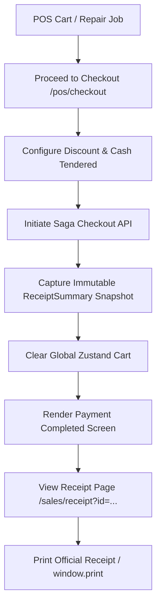

# POS Checkout and Receipts Skill

Use this skill when developing, debugging, or extending Point of Sale (POS) checkout, receipt rendering, and sales invoice workflows in MotoShop.

## Core Rules & Architecture



## Critical Implementation Guidelines

### 1. Snapshot Before Clear Pattern
When handling transaction confirmation screens:
```typescript
// ALWAYS capture snapshot before resetting store
const completedSummary: ReceiptSummary = {
  invoiceNo: generatedInvoice,
  customerName,
  motorcycleName,
  mechanicName,
  paymentMethod,
  grossSubtotal: subtotal,
  discountPercent,
  discountAmount,
  netTotalDue,
  netAmountPaid: netTotalDue,
  cashReceivedVal,
  cashChange,
  items: cart.map(item => ({ name: item.name, qty: item.qty, price: item.price }))
};
setReceiptSummary(completedSummary);
setIsSuccess(true);
clearCart(); // Safe now: confirmation UI reads from completedSummary
```

### 2. Dedicated Full-Page Receipts & 10-Section Commercial Standard
- Always open receipts on a dedicated route (`/sales/receipt?id=...`) rather than inline modal overlays.
- Wrap content in a `<Suspense>` boundary.
- **10-Section Commercial Invoice Standard**:
  1. **Official Store Header**: Shop name, address, contact numbers, and BIR TIN (`491-002-884-000 NV`).
  2. **Invoice & Order Metadata**: Invoice Number, Linked Job Order No (`JO-XXXX`), Issued Date/Time, and Status Pill (`COMPLETED` / `VOIDED`).
  3. **Customer & Bike Profile**: Customer Name, Phone, Motorcycle Model, and Plate / VIN.
  4. **Staff Attribution**: Cashier in charge, Assigned Mechanic, and Mechanic Labor Commission Rate.
  5. **Itemized Transaction Ledger**: Line items with clear `[PART]` vs `[SERVICE]` category tags, unit prices, quantities, and line totals.
  6. **BIR Tax Breakdown**: 12% VATable Sales, 12% VAT Amount, VAT-Exempt Sales, and Zero-Rated Sales.
  7. **Financial Settlement**: Gross Subtotal, Discount %, Net Total Due, Cash Tendered / Payment Method, and Change.
  8. **Workshop Commission Settlement**: Gross Labor Total, Mechanic Commission Payout, and Net Shop Retained Labor.
  9. **Warranty & Statutory Terms**: 30-day labor warranty, 7-day parts replacement policy, and statutory RA 10173 data privacy notice.
  10. **Dual Physical Signatures**: "Customer Received By" and "Authorized Cashier" physical signature lines.

### 3. Decoupled Sandbox Print Engine & Pure White Document Layout
Printable documents must be decoupled from the application DOM to guarantee zero dark-mode style bleed and zero white background on screen.

#### Component Structure (`frontend/src/components/documents/`)
- `printUtils.ts`: Houses `printIsolatedDocument(title: string, documentHtml: string)`. Creates a hidden ephemeral `<iframe>`, injects standalone A4 CSS and HTML markup, calls `.print()`, and removes the iframe.
- `PrintableInvoiceDocument.tsx`: Exports `getInvoiceDocumentHtml(props)` and `<PrintableInvoiceDocument />`.
- `PrintablePayslipDocument.tsx`: Exports `getPrintablePayslipHtml(props)` and `<PrintablePayslipDocument />`.

#### In-App Page Implementation Pattern
```tsx
// In screen page (e.g. /sales/receipt or /payroll):
return (
  <>
    {/* Screen UI: Strictly Dark Mode, Hidden on Print */}
    <div className="bg-zinc-950 text-zinc-100 w-full print:hidden">
      <button onClick={() => printIsolatedDocument(`Invoice-${inv}`, getInvoiceDocumentHtml(props))}>
        Print Official Invoice
      </button>
    </div>

    {/* Dedicated Printable Document for Native Ctrl+P */}
    <div className="hidden print:block w-full bg-white text-zinc-950">
      <PrintableInvoiceDocument {...props} />
    </div>
  </>
);
```

#### Document Canvas Rules
1. **Pure White Canvas**: Pure `#ffffff` background across all elements.
2. **Subtle Table Headers**: Header `<th>` fill `#f4f4f5` with `#09090b` text and hairline `#e4e4e7` borders.
3. **No Black Backgrounds & No Thick Borders**: Zero black background bars and no card-style enclosures.
4. **Single-Page A4 Squeeze**: Margins at `8mm`, table padding `4px 6px`, font size `7.5pt–9pt`, `break-inside: avoid`.
5. **Dynamic Store Branding**: Strictly render store branding dynamically from `getSystemSettings()` (`settings.appName`, `shopDescription`, `shopAddress`, and TIN). Prohibit the word "motoshop".
6. **Dark Mode Table Exclusions**: Ensure `globals.css` excludes `[data-printable-document="true"]`, `.printable-invoice-document`, and `.printable-payslip-document` from `html.dark table` color/background resets.

### 4. Print Cutoff Prevention & Document Styling
- **Ancestor Unconstraining**: Ensure print media styles reset all layout ancestor heights and overflow styles to prevent truncated print previews:
```css
@media print {
  html, body, #__next, div, main, section, article {
    height: auto !important;
    max-height: none !important;
    overflow: visible !important;
    position: static !important;
  }
}
```
- **Dynamic Print Filename**: Set `document.title = "Invoice-" + invoice_no` prior to calling `window.print()` so the browser default PDF filename reflects the invoice identifier.

### 4. Structured CSV Export Parity
- Provide a `Download CSV` action generating standard RFC 4180 CSV files containing identical 10-section metadata, line items, and tax calculations.
- File naming convention: `Invoice-[invoice_no].csv`.

### 5. Single Navigation & Void Safeguards
- Provide a single top navigation `< Back to Invoices` button (prohibit duplicate bottom back buttons).
- Require an irreversible danger `ConfirmModal` (`confirmVariant="danger"`) before initiating void requests (`POST /api/v1/sales/transactions/{id}/void`).

### 6. API Gateway Synchronization
- Ensure all sales endpoints are present in `krakend/krakend.json`:
  - `POST /api/v1/sales/checkout`
  - `GET /api/v1/sales/transactions`
  - `GET /api/v1/sales/transactions/{id}`
  - `POST /api/v1/sales/transactions/{id}/void`

### 7. POS Showroom Counter & 2-Column Mobile Catalog Standards

#### A. Mobile 2-Column Grid Layout
- In mobile viewports (`< md`), display active customer repair cards (Step 1) and catalog items (Step 2) in a responsive 2-column grid (`grid-cols-2 gap-2.5 sm:gap-3`).
- Cards must use `rounded-2xl overflow-hidden` with edge-to-edge top banner artwork and a structured text content body (`p-3 sm:p-4 flex flex-col justify-between`).

#### B. Floating Filter FAB & Slide-Up Sheet
- Render an unlabelled circular floating filter FAB (`data-testid="pos-mobile-filter-fab"`) directly above the floating cart button on mobile screens.
- Portaled to `document.body` or floating fixed container with bottom inset `bottom-24 right-4 z-40`.
- Includes an active filter indicator dot when filters (search, non-all subcategory) are active.
- Opens `MobilePosFilterSheet` providing:
  - Search input with clear button.
  - Catalog type selector (`Services` vs `Parts`).
  - Dynamic sub-category pill grid with live badge counts.

#### C. Dynamic Sub-Category Discovery
Always compute sub-categories dynamically from the active item list to prevent stale or cross-polluted category counts:
```typescript
const availableCategories = useMemo(() => {
  const categoriesMap = new Map<string, number>();
  const scopedItems = catalogItems.filter(item => item.item_type === activeType);
  scopedItems.forEach(item => {
    const cat = item.category?.trim() || (activeType === "SERVICE" ? "General Service" : "General Parts");
    categoriesMap.set(cat, (categoriesMap.get(cat) || 0) + 1);
  });
  return Array.from(categoriesMap.entries()).map(([name, count]) => ({ name, count }));
}, [catalogItems, activeType]);
```

#### D. Photorealistic Mechanical & Bike Category Banners
- **CategoryCardBanner**: Renders 3D-styled SVGs with multi-stop metallic linear/radial gradients (`rotor-steel`, `oil-amber`, `pulley-metal`, `spring-cyan`, `piston-crown`).
  - Strict precedence: evaluate `isBrake` before `isOil` to prevent "Brake Fluid" from matching oil bottles.
- **CustomerBikeCardBanner**: Automatically identifies bike category from motorcycle name/brand (`Maxi-Scooter`, `Sportbike`, `Naked Street`, `Hyper Underbone`, `Adventure Touring`, `Cruiser Classic`).
  - Displays workshop grid floor pattern, horizon studio lighting line, brand watermark pill (top-left), and category badge (bottom-right).

