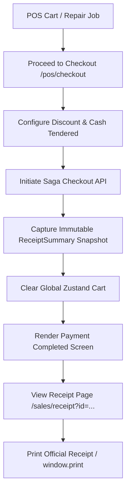

# POS Checkout and Receipts Skill

Use this skill when developing, debugging, or extending Point of Sale (POS) checkout, receipt rendering, and sales invoice workflows in MotoShop.

## Core Rules & Architecture



## Critical Implementation Guidelines

### 1. Snapshot Before Clear Pattern
When handling transaction confirmation screens:
```typescript
// ALWAYS capture snapshot before resetting store
const completedSummary: ReceiptSummary = {
  invoiceNo: generatedInvoice,
  customerName,
  motorcycleName,
  mechanicName,
  paymentMethod,
  grossSubtotal: subtotal,
  discountPercent,
  discountAmount,
  netTotalDue,
  netAmountPaid: netTotalDue,
  cashReceivedVal,
  cashChange,
  items: cart.map(item => ({ name: item.name, qty: item.qty, price: item.price }))
};
setReceiptSummary(completedSummary);
setIsSuccess(true);
clearCart(); // Safe now: confirmation UI reads from completedSummary
```

### 2. Dedicated Full-Page Receipts & 10-Section Commercial Standard
- Always open receipts on a dedicated route (`/sales/receipt?id=...`) rather than inline modal overlays.
- Wrap content in a `<Suspense>` boundary.
- **10-Section Commercial Invoice Standard**:
  1. **Official Store Header**: Shop name, address, contact numbers, and BIR TIN (`491-002-884-000 NV`).
  2. **Invoice & Order Metadata**: Invoice Number, Linked Job Order No (`JO-XXXX`), Issued Date/Time, and Status Pill (`COMPLETED` / `VOIDED`).
  3. **Customer & Bike Profile**: Customer Name, Phone, Motorcycle Model, and Plate / VIN.
  4. **Staff Attribution**: Cashier in charge, Assigned Mechanic, and Mechanic Labor Commission Rate.
  5. **Itemized Transaction Ledger**: Line items with clear `[PART]` vs `[SERVICE]` category tags, unit prices, quantities, and line totals.
  6. **BIR Tax Breakdown**: 12% VATable Sales, 12% VAT Amount, VAT-Exempt Sales, and Zero-Rated Sales.
  7. **Financial Settlement**: Gross Subtotal, Discount %, Net Total Due, Cash Tendered / Payment Method, and Change.
  8. **Workshop Commission Settlement**: Gross Labor Total, Mechanic Commission Payout, and Net Shop Retained Labor.
  9. **Warranty & Statutory Terms**: 30-day labor warranty, 7-day parts replacement policy, and statutory RA 10173 data privacy notice.
  10. **Dual Physical Signatures**: "Customer Received By" and "Authorized Cashier" physical signature lines.

### 3. Print Cutoff Prevention & Document Styling
- **Ancestor Unconstraining**: Ensure print media styles reset all layout ancestor heights and overflow styles to prevent truncated print previews:
```css
@media print {
  html, body, #__next, div, main, section, article {
    height: auto !important;
    max-height: none !important;
    overflow: visible !important;
    position: static !important;
  }
}
```
- **Dynamic Print Filename**: Set `document.title = "Invoice-" + invoice_no` prior to calling `window.print()` so the browser default PDF filename reflects the invoice identifier.

### 4. Structured CSV Export Parity
- Provide a `Download CSV` action generating standard RFC 4180 CSV files containing identical 10-section metadata, line items, and tax calculations.
- File naming convention: `Invoice-[invoice_no].csv`.

### 5. Single Navigation & Void Safeguards
- Provide a single top navigation `< Back to Invoices` button (prohibit duplicate bottom back buttons).
- Require an irreversible danger `ConfirmModal` (`confirmVariant="danger"`) before initiating void requests (`POST /api/v1/sales/transactions/{id}/void`).

### 6. API Gateway Synchronization
- Ensure all sales endpoints are present in `krakend/krakend.json`:
  - `POST /api/v1/sales/checkout`
  - `GET /api/v1/sales/transactions`
  - `GET /api/v1/sales/transactions/{id}`
  - `POST /api/v1/sales/transactions/{id}/void`
