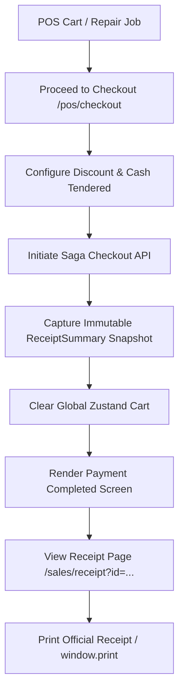

# POS Checkout and Receipts Skill

Use this skill when developing, debugging, or extending Point of Sale (POS) checkout, receipt rendering, and sales invoice workflows in MotoShop.

## Core Rules & Architecture



## Critical Implementation Guidelines

### 1. Snapshot Before Clear Pattern
When handling transaction confirmation screens:
```typescript
// ALWAYS capture snapshot before resetting store
const completedSummary: ReceiptSummary = {
  invoiceNo: generatedInvoice,
  customerName,
  motorcycleName,
  mechanicName,
  paymentMethod,
  grossSubtotal: subtotal,
  discountPercent,
  discountAmount,
  netTotalDue,
  netAmountPaid: netTotalDue,
  cashReceivedVal,
  cashChange,
  items: cart.map(item => ({ name: item.name, qty: item.qty, price: item.price }))
};
setReceiptSummary(completedSummary);
setIsSuccess(true);
clearCart(); // Safe now: confirmation UI reads from completedSummary
```

### 2. Dedicated Full-Page Receipts
- Always open receipts on a dedicated route (`/sales/receipt?id=...`) rather than inline modal overlays.
- Wrap content in a `<Suspense>` boundary.
- Provide:
  - Header with Invoice #, date, time, and status pill (`COMPLETED` / `VOIDED`).
  - Cashier and Mechanic staff attribution.
  - Linked jump buttons (Cashier Audit Log, Mechanic Service History, Customer Lifetime Log).
  - Itemized table showing item names, quantities, unit prices, and totals.
  - Financial breakdown (Subtotal, Discount, Net Amount Paid, Cash Received, Cash Change).
  - **Print Official Receipt** button (`window.print()`).
  - **Copy Invoice #** button.
  - **Return to Sales Management** button.

### 3. API Gateway Synchronization
- Ensure all sales endpoints are present in `krakend/krakend.json`:
  - `POST /api/v1/sales/checkout`
  - `GET /api/v1/sales/transactions`
  - `GET /api/v1/sales/transactions/{id}`
  - `POST /api/v1/sales/transactions/{id}/void`
