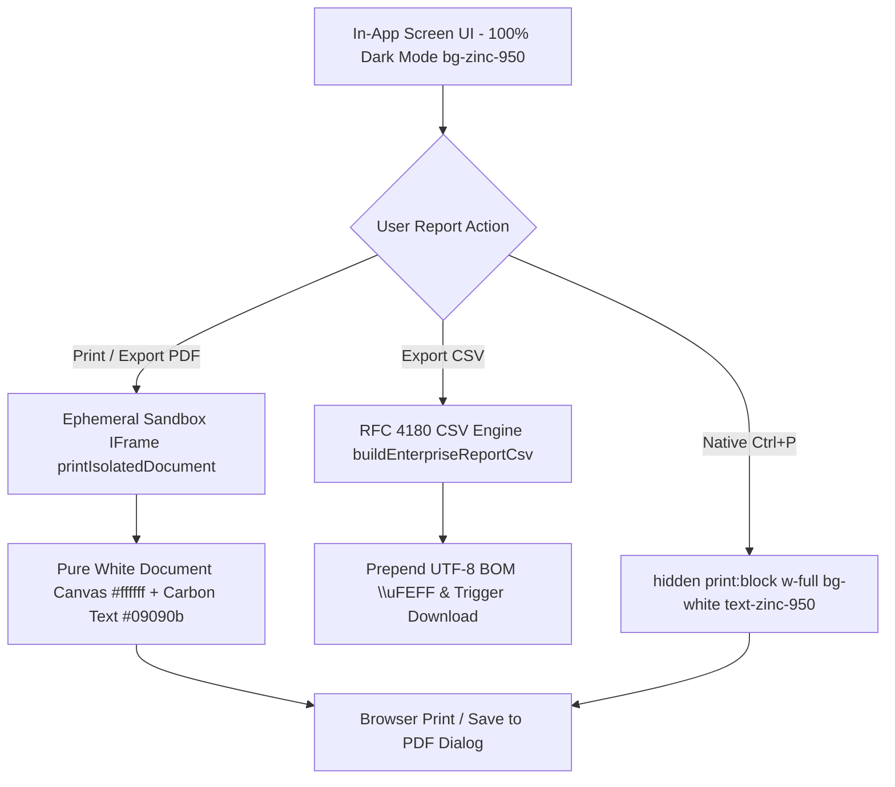

# Enterprise Report Generation & Decoupled Document Skill

Use this skill when developing, refactoring, or extending analytical, operational, or financial reports across MotoShop.

---

## 1. Core Architectural Invariants



### Mandatory Rules
1. **Screen UI 100% Dark Mode**: Operational dashboard screens remain strictly in `bg-zinc-950` with `text-zinc-100`. Bright white report cards or inline document paper mockups must **NEVER** be displayed directly on the screen.
2. **View Only on Export / Print**: The white report layout is only presented to the user inside the browser print preview dialog (via isolated sandbox `<iframe>`) or downloaded as an official document.
3. **Pure White Canvas Standard**:
   - Canvas background: `#ffffff`
   - Primary typography: `#09090b` (deep carbon black)
   - Secondary / muted text: `#52525b` and `#71717a`
   - Table header fills: `#f4f4f5`
   - Borders: `#e4e4e7` (1px solid hairline)
   - **Strictly NO black backgrounds, NO thick black borders, NO card-style enclosures.**
4. **Dynamic App Branding**: Store name, trade description, address, TIN, and contact details must be dynamically extracted via `getSystemSettings()` (`settings.appName || "Versiklo"`). Zero occurrences of hardcoded "motoshop".
5. **Dual-Export Parity**: Every report must offer both **"Print / PDF Report"** and **"Export CSV"**.

---

## 2. Standardized 5-Section Master Template

All report documents must implement the standardized 5 sections provided by `PrintableReportLayout.tsx`:

1. **Section 1: App Brand Header**
   - Brand title (e.g. `VERSIKLO`), uppercase trade description (`MOTORCYCLE PARTS & SERVICES`), shop address, BIR TIN (`491-002-884-000 NV`), phone, and compliance email.
2. **Section 2: Document Meta Ribbon**
   - Report Title, Target Period/Filter (e.g. `Monthly Statement: September 2026`), Reference code (`REP-FIN-...`), Generated By (user name and role), Generation timestamp, and `OFFICIAL AUDITED COPY` status pill.
3. **Section 3: Executive KPI Cards**
   - 4-column summary metric cards (`#fafafa` fill with `#e4e4e7` border) highlighting high-level totals (Gross Sales, Overhead Expenses, Labor Commissions, Net Operating Margin).
4. **Section 4: Itemized Data Grid**
   - Clean tabular records with `#f4f4f5` header fills, `#e4e4e7` cell borders, carbon text, formatted currency (`₱`), and status badges.
5. **Section 5: Official Certification Signatures & Compliance Footer**
   - Triple signature blocks:
     - `Prepared By`: Authorized Signatory / Date
     - `Reviewed By`: Internal Audit / Operations Verification / Date
     - `Approved By`: Shop Director / General Manager / Date
   - Compliance disclaimer note and system version watermark (`Versiklo Engine v2.4 • Confidential`).

---

## 3. How to Create a New Report Document

### Step 1: Create Document Generator in `frontend/src/components/documents/`

```typescript
import React from "react";
import { SystemSettings } from "@/lib/settings";
import {
  generateReportShellHtml,
  PrintableReportLayout,
  ReportKpiCard
} from "./PrintableReportLayout";

export interface CustomReportProps {
  settings: SystemSettings;
  periodLabel: string;
  reportRef?: string;
  generatedBy?: string;
  generatedDate?: string;
  // Module-specific metrics and data
  kpiData: ReportKpiCard[];
  tableRecords: any[];
}

/**
 * HTML string generator for printIsolatedDocument sandbox iframe.
 */
export function getCustomReportDocumentHtml(props: CustomReportProps): string {
  const { settings, periodLabel, reportRef, generatedBy, generatedDate, kpiData, tableRecords } = props;

  const contentHtml = `
    <table style="width: 100%; border-collapse: collapse; background: #ffffff;">
      <thead>
        <tr style="background-color: #f4f4f5;">
          <th style="padding: 4px 6px; border: 1px solid #e4e4e7; text-align: left;">Item</th>
          <th style="padding: 4px 6px; border: 1px solid #e4e4e7; text-align: right;">Total</th>
        </tr>
      </thead>
      <tbody>
        ${tableRecords.map(r => `
          <tr style="background-color: #ffffff;">
            <td style="padding: 4px 6px; border: 1px solid #e4e4e7; color: #09090b;">${r.name}</td>
            <td style="padding: 4px 6px; border: 1px solid #e4e4e7; text-align: right; color: #09090b; font-family: monospace;">₱${r.total.toFixed(2)}</td>
          </tr>
        `).join("")}
      </tbody>
    </table>
  `;

  return generateReportShellHtml({
    settings,
    reportTitle: "Custom Operational Report",
    periodLabel,
    reportRef,
    generatedBy,
    generatedDate,
    kpiCards: kpiData,
    contentHtml
  });
}

/**
 * React Component counterpart for native Ctrl+P fallback container.
 */
export function PrintableCustomReportDocument(props: CustomReportProps) {
  return (
    <PrintableReportLayout
      settings={props.settings}
      reportTitle="Custom Operational Report"
      periodLabel={props.periodLabel}
      reportRef={props.reportRef}
      generatedBy={props.generatedBy}
      generatedDate={props.generatedDate}
      kpiCards={props.kpiData}
    >
      {/* Table JSX */}
    </PrintableReportLayout>
  );
}
```

---

## 4. How to Wire the Page UI with Dual Export

### Step 2: Implement Handlers in Page Component

```typescript
import { getSystemSettings, SystemSettings } from "@/lib/settings";
import { 
  buildEnterpriseReportCsv, 
  downloadCsvFile, 
  printIsolatedDocument 
} from "@/components/documents/reportExportUtils";
import { 
  PrintableCustomReportDocument, 
  getCustomReportDocumentHtml 
} from "@/components/documents/PrintableCustomReportDocument";

// Inside component:
const [settings, setSettings] = useState<SystemSettings>(getSystemSettings());

// 1. Print / Save as PDF Trigger
const handlePrintReport = () => {
  const docHtml = getCustomReportDocumentHtml({
    settings,
    periodLabel: "September 2026",
    reportRef: "REP-CUST-001",
    generatedBy: "admin@versiklo.ph (MANAGER)",
    generatedDate: new Date().toLocaleString(),
    kpiData: [...],
    tableRecords: [...]
  });

  printIsolatedDocument("Custom-Report", docHtml);
};

// 2. Export RFC 4180 CSV Trigger
const handleExportCsv = () => {
  const csvContent = buildEnterpriseReportCsv(
    {
      appName: settings.appName || "Versiklo",
      shopDescription: settings.shopDescription,
      shopAddress: settings.shopAddress,
      shopTin: settings.shopTin,
      reportTitle: "Custom Operational Report",
      periodLabel: "September 2026",
      generatedBy: "admin@versiklo.ph (MANAGER)",
      generatedDate: new Date().toLocaleString()
    },
    {
      headers: ["Item Description", "Category", "Quantity", "Total (PHP)"],
      rows: records.map(r => [r.name, r.category, r.qty, r.total.toFixed(2)]),
      summaryRows: [["Grand Total", "", "", grandTotal.toFixed(2)]]
    }
  );

  downloadCsvFile("custom_report_september_2026.csv", csvContent);
};
```

### Step 3: Mount Screen UI & Native Print Fallback

```tsx
return (
  <>
    {/* Screen UI: Strictly 100% Dark Mode, hidden when printing */}
    <div className="min-h-full bg-zinc-950 text-zinc-100 p-6 print:hidden">
      <div className="flex justify-between items-center mb-6">
        <h1 className="text-2xl font-black text-white">Custom Report</h1>
        <div className="flex gap-2.5">
          <button onClick={handleExportCsv} className="btn-secondary">Export CSV</button>
          <button onClick={handlePrintReport} className="btn-primary">Print / PDF Report</button>
        </div>
      </div>
      {/* Dark mode tables & KPI cards */}
    </div>

    {/* Native Ctrl+P Fallback Container: Hidden on screen, rendered by browser print */}
    <div className="hidden print:block w-full bg-white text-zinc-950">
      <PrintableCustomReportDocument settings={settings} ... />
    </div>
  </>
);
```

---

## 5. Role-Based Access Control (RBAC) Matrix

| Report Type | Route | Admin | Manager | Cashier | Mechanic / Advisor |
| :--- | :--- | :---: | :---: | :---: | :---: |
| **Financial Ledger & P&L** | `/reports/extract` | ✅ Full | ✅ Full | ❌ Restricted | ❌ Restricted |
| **Inventory Stock Valuation** | `/inventory` | ✅ Full | ✅ Full | ❌ Restricted | ❌ Restricted |
| **Sales & End-of-Day Audit** | `/sales` | ✅ Full | ✅ Full | ✅ Full | ❌ Restricted |
| **Workshop Service Records** | `/repairs/history/logs` | ✅ Full | ✅ Full | ❌ Restricted | ✅ Full |
| **Commercial Invoices** | `/sales/receipt` | ✅ Full | ✅ Full | ✅ Full | ❌ Restricted |
| **Staff Payslips** | `/payroll/payslip` | ✅ Full | ✅ Full | ❌ Restricted | ❌ Restricted |
