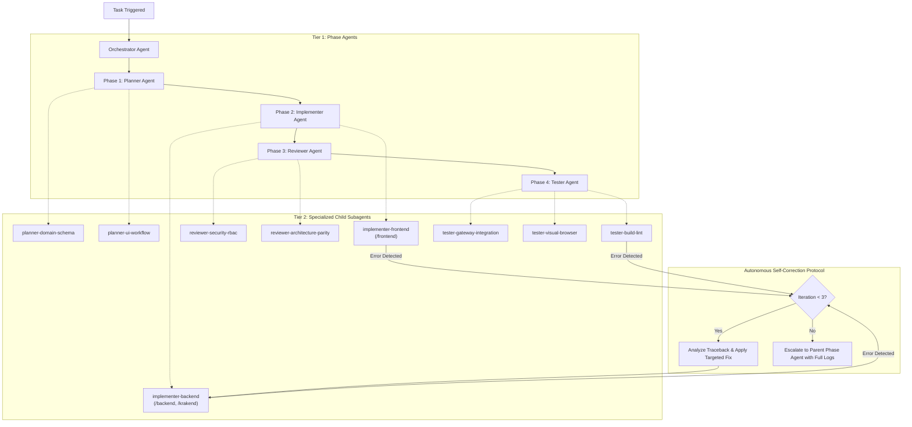

# Skill: Subagent Delegation Protocol

This skill provides the operational standards, communication contracts, and error handling protocols for spawning and supervising specialized child subagents at runtime across the MotoShop Multi-Agent Operating System.

## 1. 2-Tier Hierarchical Delegation Architecture



## 2. Standardized Subagent Contract Protocol

### A. Subagent Input Brief (Parent $\to$ Child)
Every subagent invocation must receive a structured brief:
```markdown
### Subagent Task Brief: <subagent_id>
- **Role**: <role_name> (e.g. implementer-frontend, tester-build-lint)
- **Objective**: Exact single-responsibility deliverable
- **File Scope**: Explicit list of allowed file paths (strictly disjoint across concurrent subagents)
- **Active Invariants**: Relevant architectural, styling, or session rules from AGENTS.md
- **Reference Context**: Specific API schemas, models, or design tokens
- **Verification Command**: Exact command to run to validate deliverables
```

### B. Subagent Deliverable Report (Child $\to$ Parent)
Every subagent must return a structured completion report:
```markdown
### Subagent Deliverable Report: <subagent_id>
- **Status**: SUCCESS | ESCALATE
- **Modified Files**: List of touched files with concise diff summaries
- **Verification Performed**: Commands run, tests executed, and exit codes
- **Self-Correction Log**: Iterations attempted (if compile/lint errors occurred)
- **Identified Risks / Blockers**: Any unresolved issues requiring parent coordination
```

## 3. Disjoint File Scope Rule (Concurrent Implementers)
When multiple subagents operate concurrently:
- **`implementer-backend`**: Strictly constrained to `/backend`, `/krakend`, and Docker files.
- **`implementer-frontend`**: Strictly constrained to `/frontend/src`, `/frontend/public`, and `frontend/package.json`.
- Overlapping file modifications across concurrent subagents are strictly prohibited to prevent race conditions and merge conflicts.

## 4. Autonomous 3-Iteration Self-Correction Loop
- When a subagent encounters a compiler, linter, or test failure:
  1. Parse the exact error message and file line numbers.
  2. Perform targeted fixes.
  3. Re-run verification.
  4. Iterate up to **3 times** autonomously.
- If unresolved after 3 attempts, halt further modifications and return an `ESCALATE` report with tracebacks and diffs to the parent Phase Agent.
