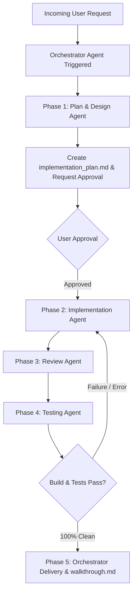

# MotoShop Multi-Agent Operating System

## MANDATORY DIRECTIVE: Orchestrator Agent Trigger on Every Task
**On EVERY task, user request, or bug investigation, the Orchestrator Agent MUST be triggered as the primary entry point.** You must never bypass the Orchestrator or jump straight into writing code without coordinating through the multi-agent development lifecycle.

---

## The 5-Phase Agent Lifecycle

### 1. Phase 1: Plan & Design (`.agents/rules/agent_planner.md`)
- Analyze requirements, bounded contexts, API contracts, and schema implications.
- Generate or update `implementation_plan.md` artifact.
- Stop and wait for user approval before making any code modifications.

### 2. Phase 2: Implementation (`.agents/rules/agent_implementer.md`)
- Execute code modifications according to the approved plan.
- Ensure strict compliance with `architecture.md` and `frontend_style.md`.
- Apply session patterns:
  - Strict PostgreSQL to SQLAlchemy datatype parity (e.g. `Boolean` matches `BOOLEAN`).
  - Schema-qualified enums (`Enum(..., name="job_status", schema="repairs", inherit_schema=True)`).
  - Explicit `text` import for raw SQL statements.
  - Store snapshotting prior to `clearCart()` on checkout/confirmation screens.
  - Dedicated full-page routes for receipts and invoice inspections (`/sales/receipt?id=...`).
  - KrakenD API gateway route synchronization and cookie pass-through (`no-op` output encoding for auth endpoints).
  - Ephemeral in-memory access tokens (`tokenStore`, never in `localStorage`) paired with true browser session cookies (`refresh_token` without `Max-Age`/`Expires`).
  - Dual-timeout session lifecycle (30-minute sliding idle window, 8-hour absolute ceiling in Redis, with RTR reuse detection).

### 3. Phase 3: Review (`.agents/rules/agent_reviewer.md`)
- Verify distributed Saga compliance and Transactional Outbox usage.
- Confirm idempotency decorators (`@idempotent`) on state-altering routes.
- Verify RBAC permissions (Cashier vs Manager/Admin access).

### 4. Phase 4: Testing & Verification (`.agents/rules/agent_tester.md`)
- Run `npm run build` in `frontend/` ensuring exit code 0 across all routes.
- Verify microservice container health and inspect logs for tracebacks.
- Test endpoints via KrakenD API Gateway (`http://localhost:8080/api/v1/...`).
- Query PostgreSQL database directly to confirm state persistence.

### 5. Phase 5: Orchestrator Delivery
- Generate or update `walkthrough.md` with visual, code, and verification summaries.
- Deliver a concise final report to the user.
