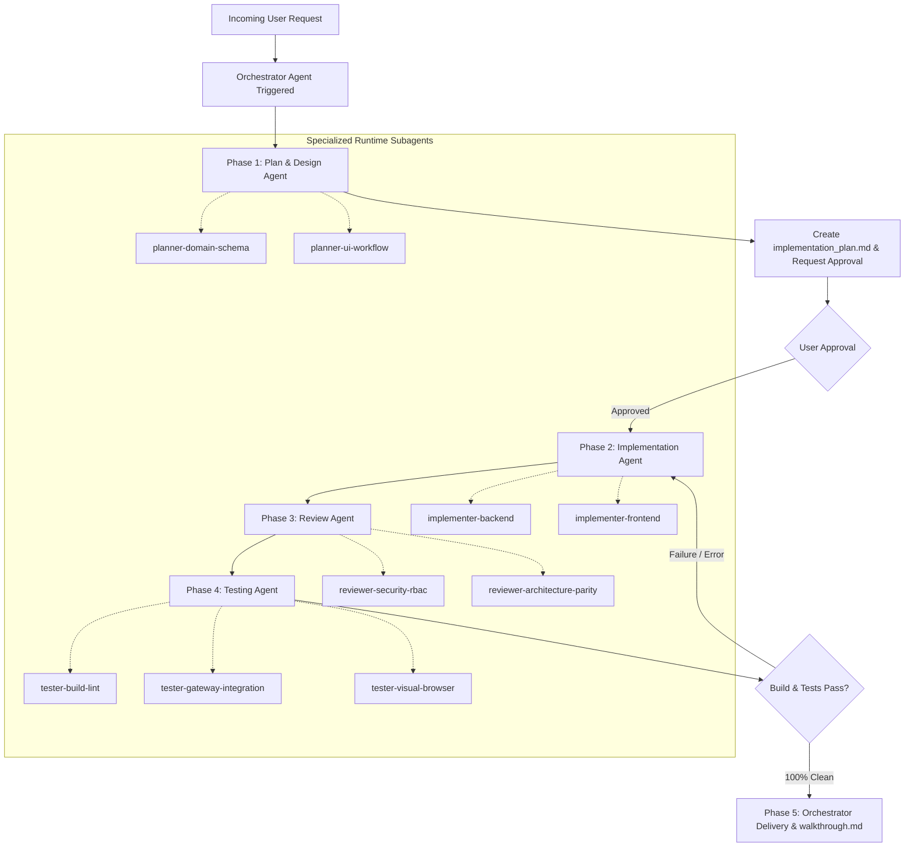

# MotoShop Multi-Agent Operating System

## MANDATORY DIRECTIVE: Orchestrator Agent Trigger on Every Task
**On EVERY task, user request, or bug investigation, the Orchestrator Agent MUST be triggered as the primary entry point.** You must never bypass the Orchestrator or jump straight into writing code without coordinating through the multi-agent development lifecycle.

---

## The 5-Phase Agent Lifecycle



### 1. Phase 1: Plan & Design (`.agents/rules/agent_planner.md` & [agent-planner](file:///d:/POS/motorcycle-shop-management-system/.agents/skills/agent-planner/SKILL.md))
- Analyze requirements, bounded contexts, API contracts, and schema implications.
- Empowered to spawn `planner-domain-schema` and `planner-ui-workflow` child subagents at runtime.
- Generate or update `implementation_plan.md` artifact.
- Stop and wait for user approval before making any code modifications.

### 2. Phase 2: Implementation (`.agents/rules/agent_implementer.md` & [agent-implementer](file:///d:/POS/motorcycle-shop-management-system/.agents/skills/agent-implementer/SKILL.md))
- Execute code modifications according to the approved plan.
- Empowered to spawn concurrent `implementer-backend` and `implementer-frontend` child subagents at runtime.
- Ensure strict compliance with `architecture.md` and `frontend_style.md`.
- Apply session patterns:
  - Strict PostgreSQL to SQLAlchemy datatype parity (e.g. `Boolean` matches `BOOLEAN`).
  - Schema-qualified enums (`Enum(..., name="job_status", schema="repairs", inherit_schema=True)`).
  - Explicit `text` import for raw SQL statements.
  - Store snapshotting prior to `clearCart()` on checkout/confirmation screens.
  - Dedicated full-page routes for receipts and invoice inspections (`/sales/receipt?id=...`).
  - KrakenD API gateway route synchronization and cookie pass-through (`no-op` output encoding for auth endpoints).
  - Ephemeral in-memory access tokens (`tokenStore`, never in `localStorage`) paired with true browser session cookies (`refresh_token` without `Max-Age`/`Expires`).
  - Dual-timeout session lifecycle (30-minute sliding idle window, 8-hour absolute ceiling in Redis, with RTR reuse detection).
  - Root `document.body` portaling for mobile floating action buttons (`FloatingFilterButton`) and slide-up drawers/modals with safe-area bottom insets (`env(safe-area-inset-bottom)`).
  - Consolidated audit logs strictly housed in Settings (`/settings?tab=logs`) and `/audit-logs` (never scattered as standalone buttons on operational pages).
  - Card-free split-screen login layout directly on the canvas without boxed card enclosures.
  - High-Octane Minimalist Light Theme: Pure white canvas (`#ffffff`), metallic hairline dividers (`#e2e8f0`), deep carbon typography (`#18181b`), and Kawasaki racing lime green accents (`#84cc16`).
  - WCAG AAA Button Text Contrast Invariant: Solid lime green buttons (`bg-lime-500`, `bg-cyan-500`) MUST strictly use bold carbon black text (`#09090b`), yielding contrast > 12:1. White text on lime green is prohibited.
  - 10-Section Official Commercial Invoice Standard: Full-page receipts (`/sales/receipt`) must capture store header & TIN, order metadata, customer & bike profile, staff attribution & commission rates, categorized line items (`[PART]` vs `[SERVICE]`), BIR 12% VAT breakdown, financial settlement, labor commission settlement, warranty terms, and physical signatures.
  - Print Cutoff Prevention Invariant: `@media print` must unconstrain ancestor containers (`html, body, #__next, div, main, section, article { height: auto !important; max-height: none !important; overflow: visible !important; position: static !important; }`) and set dynamic `document.title = "Invoice-" + invoice_no`.
  - Structured CSV Export Parity: Invoices must offer standard RFC 4180 CSV download containing identical 10-section data.
  - Transaction Void Safeguard & Navigation: Irreversible danger `ConfirmModal` (`confirmVariant="danger"`) before voiding sales; single top `< Back to Invoices` navigation without redundant bottom buttons.
  - Public route silent refresh guard: verify `user_role` before firing `/auth/refresh` on `/login` to avoid red 401 console errors.
  - Mobile Repair Board Invariant: Replace Kanban boards on mobile (< md) with Tabbed Status Navigation, dual forward/revert stage buttons with ConfirmModal safeguards, and eliminate redundant top search bars in favor of FloatingFilterButton.
  - Mobile Job Profile Card-Free Invariant: Prohibit boxed card enclosures on mobile (< md); use an edge-to-edge canvas with borderless list rows, subtle dividers, and a sticky 4-tab menu (Overview, Diagnosis, Parts & Services, History).
  - Resilient Identifier Typing: Backend route parameters for entity lookups must use str (not UUID), safely querying UUID, invoice/JO number, and string-cast ID to eliminate 422 errors. Frontend fallbacks must use uuidv4().
  - Strict Light & Dark Mode CSS Separation & Persistence: Prohibit unmount mode rollback in pages/tabs; strictly scope light text remappings under `html:not(.dark)`; enforce explicit dark form controls/tables under `html.dark`; protect BIR white canvas receipts with `:not(:where(.printable-receipt, ...))` zero-specificity exclusions.
  - Zero Repository Artifact Pollution Invariant: Prohibit storing visual test captures, screenshots, video recordings, or temporary testing outputs inside the project repository workspace (e.g. `frontend/tests/artifacts` or repository root). All runtime visual proofs must target `process.env.ARTIFACTS_DIR` (or system temporary directory `os.tmpdir()`), leaving the git working tree 100% clean.
  - Decoupled Printable Document Invariant: Printable documents (Invoices, Payslips, Financial Vouchers, Reports) must have dedicated layout components in `frontend/src/components/documents/` (e.g. `PrintableReportLayout.tsx`, `PrintableFinancialReportDocument.tsx`, `PrintableSalesReportDocument.tsx`, `PrintableInventoryReportDocument.tsx`, `PrintableRepairReportDocument.tsx`, `PrintableInvoiceDocument.tsx`, `PrintablePayslipDocument.tsx`, `printUtils.ts`, `reportExportUtils.ts`), strictly separated from the application screen UI.
    - In-App Screen UI: Must strictly remain in dark mode (`bg-zinc-950`, `text-zinc-100`) without any white background visible on screen. The screen container must have `print:hidden`. White report canvases are never rendered as bright webpage cards on screen.
    - Isolated IFrame Sandbox Printing: In-app print buttons must invoke `printIsolatedDocument(title, html)` to render markup inside an ephemeral sandbox `<iframe>` with isolated A4 `@page` rules, preventing `html.dark` CSS leakage.
    - Native Ctrl+P Fallback: Screen pages must mount the dedicated printable document inside a `<div className="hidden print:block w-full bg-white text-zinc-950">` container.
    - Pure White Canvas Invariant: The document canvas must be pure `#ffffff` with carbon typography (`#09090b`), `#f4f4f5` table header fills, and `#e4e4e7` hairline borders. NO black backgrounds, NO thick black borders, NO card-style enclosures, and ZERO occurrences of the word "motoshop" (strictly use dynamic settings via `getSystemSettings()`).
    - Single-Page A4 Squeeze: Layouts must squeeze into a single A4 page (`margin: 8mm`, table cell padding `4px 6px`, font size `7.5pt–9pt`).
    - Dark Mode Table Style Exclusions: All dark-mode table overrides in `globals.css` must explicitly exclude printable document selectors (`[data-printable-document="true"]`, `.printable-report-document`, `.printable-invoice-document`, `.printable-payslip-document`).
  - Standardized 5-Section Master Report & Dual-Export Invariant: All analytical and operational report functions (Shop Financial Ledger in `/reports/extract`, Sales Summaries & End-of-Day in `/sales`, Inventory Stock Valuation in `/inventory`, and Workshop Service Records in `/repairs/history/logs`) must follow a unified architecture:
    - Standardized 5 Sections: App Brand Header (store name, TIN, address, contact), Document Meta Ribbon (title, period, ref, generated by, timestamp), Executive KPI Cards (4-column summary), Itemized Data Tables, and Official Certification Signatures (triple blocks: Prepared By, Reviewed By, Approved By) with a statutory compliance disclaimer footer.
    - Dual-Export Parity (PDF + RFC 4180 CSV): Every report module must offer both "Print / PDF Report" (via `printIsolatedDocument`) and "Export CSV" (via `downloadCsvFile`). All CSV exports must include letterhead metadata and prepend a UTF-8 Byte Order Mark (`\uFEFF`) to prevent CP1252/ANSI mojibake on currency symbols (`₱`) in Microsoft Excel for Windows.
    - Role-Gated Access Control: Financial Ledger and Inventory Valuation reports restricted to Admin and Manager roles; Sales summaries accessible to Cashier/Manager/Admin; Repair Service logs accessible to Service Staff/Mechanic/Manager.
  - POS Mobile 2-Column & Floating Filter FAB Invariant: In POS mobile view (< md), active customer repair cards (Step 1) and catalog item cards (Step 2 products & services) must be presented in a responsive 2-column grid (`grid-cols-2 gap-2.5 sm:gap-3`). An unlabelled circular floating filter action button (`FloatingFilterFab`, `data-testid="pos-mobile-filter-fab"`) positioned directly above the floating cart FAB summons a slide-up drawer (`MobilePosFilterSheet`) consolidating search, item type toggling (`Services` vs `Parts`), and dynamic sub-category pills.
  - 100% Motorcycle-Specific Asset Invariant (Strictly Zero Cars): All catalog cards, workshop service banners, and repair board customer cards must feature 100% motorcycle-specific hardware, mechanics, and workshop scenes. Cars, car engines, and automotive parts are strictly prohibited.
    - Service Banners: Must capture exact motorcycle workshop operations:
      - Brakes: Ventilated wave floating rotor with racing caliper (RCB) and braided line.
      - Engine: Motorcycle single-cylinder engine block with cooling fins, honed bore, forged piston kit, and cylinder head with valves.
      - Oil & Flush: 4T synthetic motorcycle oil bottle (Motul 7100) pouring through funnel into crankcase with visible clutch cover and circular oil level sight glass.
      - Filter: Motorcycle airbox housing with red performance air filter element installation and oil filter cartridge.
      - Electrical: Stator magneto coil with 12 copper windings, motorcycle frame wiring harness, battery, and digital multimeter reading ~13.6-14.4V.
      - PMS / Tuneup: Motorcycle elevated on hydraulic scissor lift undergoing inspection with electronic handheld OBD diagnostic tablet.
      - Tire Service: Digital tire pressure gauge reading ~32-33 PSI on a 90° CNC valve stem of an alloy wheel, with tread depth gauge, swingarm, and drive chain.
      - CVT / Drivetrain: Open scooter CVT crankcase showing variator pulley, drive belt, rollers, and clutch bell.
    - Parts Catalog: Hardware banners must reference top brands in the Philippine motorcycle aftermarket (RCB / Racing Boy, Uma Racing, JVT / MTRT, Motul 7100, Maxxis, Pirelli).
    - Customer Card Banners: Must reference top Philippine motorcycle models (Yamaha NMAX 155, Honda Click 125i/160, Suzuki Raider R150 Fi, Yamaha Sniper 155, Yamaha YZF-R15, Yamaha MT-15, Honda ADV 160, Honda Rebel 500).
      - Prohibit bottom-right motorcycle name watermark tag on customer cards.
      - Category badges must strictly use a unified monochrome dark theme (`bg-zinc-950/90 text-zinc-100 border-zinc-700/90 font-mono` with crisp white text).
  - AI Image Generation Cooldown & Reactive Scheduling Protocol: When `generate_image` returns an HTTP 429 quota exhaustion (`RESOURCE_EXHAUSTED`), agents must extract the `quotaResetDelay`, configure a background one-shot timer via `schedule` (`TimerCondition="never"`), format all queued prompts, and notify the user of the scheduled wakeup rather than polling or unapproved vector substitutions.
  - Playwright MCP Root Relocation & Zero Pollution Guard: Because Playwright MCP restricts screenshot saving to `.playwright-mcp` or workspace root, agents capturing browser screenshots must immediately move `.png` outputs to `process.env.ARTIFACTS_DIR` (or `<appDataDir>\brain\<conversation-id>`) and recursively delete `.playwright-mcp`, maintaining a 100% clean git working tree.
  - Master Directory Table & Clean Row Action Invariant: In master directory and registry tables (Bike Registry, Customer Records, Inventory, Users), table rows must NOT contain inline edit/delete action icon buttons (Pencil/Trash2). Rows must be fully clickable, retaining only an animated ChevronRight indicator (with hover-revealed "Edit/View Profile" label). Destructive operations (Archive/Delete) belong strictly inside the entity's Edit modal footer on the left side (responsive: full-width bottom-stacked on mobile, left-aligned on desktop `sm:justify-between`), prompting the standard ConfirmModal danger safeguard before executing.
  - Master Directory Table Behavioral Parity Invariant: Master entity tables must maintain 100% layout and interaction parity:
    - Mobile (< md): Borderless edge-to-edge list rows with `divide-y divide-zinc-800/80 pb-24` (prohibiting boxed cards).
    - Desktop: Sticky header with zinc dividers (`divide-y divide-zinc-800/80 bg-zinc-900/40`), row hover highlighting (`hover:bg-zinc-800/40 cursor-pointer group`), and fixed table footer with real-time record count and role accessibility permissions.
  - Strict UTF-8 Encoding & Mojibake Prevention Invariant: All file edits and UI string constants must strictly enforce UTF-8 without Windows CP437/1252 codepage degradation. The Philippine Peso currency symbol must strictly render as `₱` (never `Γé▒`), em-dashes as `—` (never `ΓÇö`), and international characters properly preserved (e.g. `Akrapovič`).

### 3. Phase 3: Review (`.agents/rules/agent_reviewer.md` & [agent-reviewer](file:///d:/POS/motorcycle-shop-management-system/.agents/skills/agent-reviewer/SKILL.md))
- Empowered to spawn `reviewer-security-rbac` and `reviewer-architecture-parity` child subagents at runtime.
- Verify distributed Saga compliance and Transactional Outbox usage.
- Confirm idempotency decorators (`@idempotent`) on state-altering routes.
- Verify RBAC permissions (Cashier vs Manager/Admin access).

### 4. Phase 4: Testing & Verification (`.agents/rules/agent_tester.md` & [agent-tester](file:///d:/POS/motorcycle-shop-management-system/.agents/skills/agent-tester/SKILL.md))
- Empowered to spawn concurrent `tester-build-lint`, `tester-gateway-integration`, and `tester-visual-browser` child subagents at runtime.
- Run `npm run build` in `frontend/` ensuring exit code 0 across all routes.
- Verify microservice container health and inspect logs for tracebacks.
- Test endpoints via KrakenD API Gateway (`http://localhost:8080/api/v1/...`).
- Query PostgreSQL database directly to confirm state persistence.

### 5. Phase 5: Orchestrator Delivery (`.agents/rules/agent_orchestrator.md` & [agent-orchestrator](file:///d:/POS/motorcycle-shop-management-system/.agents/skills/agent-orchestrator/SKILL.md))
- Generate or update `walkthrough.md` with visual, code, and verification summaries.
- Deliver a concise final report to the user.

---

## Runtime Subagent Delegation Protocol ([subagent-delegation](file:///d:/POS/motorcycle-shop-management-system/.agents/skills/subagent-delegation/SKILL.md))

All registered Phase Agents are explicitly authorized and instructed to spawn specialized child subagents at runtime to execute concurrent, isolated subtasks with strict precision.

### 1. 2-Tier Hierarchical Delegation Model
- **Tier 1 (Phase Agents)**: The primary Orchestrator coordinates the 5-phase lifecycle and invokes Phase Agents.
- **Tier 2 (Specialist Subagents)**: Each Phase Agent acts as a supervisor, spawning specialized child subagents for focused subtasks:
  - **Phase 1 (Planner)**:
    - `planner-domain-schema`: Investigates PostgreSQL tables, SQLAlchemy models, Alembic migrations, KrakenD gateway routing, and Transactional Outbox events.
    - `planner-ui-workflow`: Outlines component hierarchies, responsive wireframes, Zustand store states, and mobile touch interactions.
  - **Phase 2 (Implementer)**:
    - `implementer-backend`: Writes FastAPI services, SQLAlchemy models, database migrations, and outbox Saga publishers within `/backend` and `/krakend`.
    - `implementer-frontend`: Writes Next.js pages, Tailwind CSS styles, Zustand client stores, and UI components within `/frontend`.
  - **Phase 3 (Reviewer)**:
    - `reviewer-security-rbac`: Audits access control lists, token storage invariants, cookie expiration flags, and unauthorized mutations.
    - `reviewer-architecture-parity`: Verifies PostgreSQL-SQLAlchemy type parity, transactional outbox patterns, and state snapshots prior to `clearCart()`.
  - **Phase 4 (Tester)**:
    - `tester-build-lint`: Executes `npm run build` and TypeScript static typechecks in `frontend/`.
    - `tester-gateway-integration`: Verifies microservice endpoints through KrakenD (`http://localhost:8080/api/v1/...`) and asserts PostgreSQL persistence.
    - `tester-visual-browser`: Tests user interaction flows, mobile responsiveness, WCAG button text contrast, and white canvas receipt invariants via Playwright.

### 2. Standardized Subagent Contract Protocol

#### A. Subagent Input Brief (Parent $\to$ Child)
Every subagent invocation must receive a structured brief with inlined skill instructions:
```markdown
### Subagent Task Brief: <subagent_id>
- **Role**: <role_name> (e.g. implementer-frontend)
- **Objective**: Exact single-responsibility deliverable
- **File Scope**: Explicit list of files allowed to be created or modified (strictly disjoint across concurrent subagents)
- **Required Skills**: [skill-name-1, skill-name-2] (e.g. `frontend-design`, `pos-checkout-and-receipts`)
- **Inlined Skill Instructions & Constraints**: Distilled steps, invariants, and checklists extracted from relevant SKILL.md by the parent agent
- **Active Invariants**: Relevant architectural, styling, or session rules from AGENTS.md
- **Reference Context**: Specific API schemas, models, or design tokens
- **Verification Command**: Exact local command to run to validate deliverables
```

#### B. Subagent Return Report (Child $\to$ Parent)
Every subagent must return a structured completion report:
```markdown
### Subagent Deliverable Report: <subagent_id>
- **Status**: SUCCESS | ESCALATE
- **Modified Files**: List of touched files with concise diff summaries
- **Verification Performed**: Commands run, tests executed, or linters passed
- **Self-Correction Log**: Iterations attempted (if compile/lint errors occurred)
- **Identified Risks / Blockers**: Any unresolved issues requiring parent coordination
```

### 3. Autonomous Self-Correction & Escalation Protocol
- **3-Iteration Autonomous Loop**: When a subagent encounters a compile, lint, or test failure, it must autonomously analyze the error and self-correct up to **3 iterations** without failing early.
- **Parent Escalation**: If an issue remains unresolved after 3 iterations, the subagent halts modifications and returns an `ESCALATE` status containing full error tracebacks and code diffs to its parent Phase Agent.
- **Orchestrator Resolution**: The parent Phase Agent coordinates a targeted fix across sibling subagents or escalates to the Orchestrator for architectural re-planning.

### 4. Hybrid Secondary Skill Discovery & Scope Invariant
- **Local Scope Discovery**: If a child subagent discovers an unexpected requirement during execution, it is authorized to directly view additional skills in `.agents/skills/<skill_name>/SKILL.md` using `view_file`, provided the required action remains strictly within its assigned file scope.
- **Cross-Scope Escalation**: If addressing the requirement requires modifying files outside the subagent's assigned file boundary (e.g. `implementer-frontend` discovering a missing backend database field or API route), the subagent must immediately halt and return an `ESCALATE` status report to its parent Phase Agent.

---

## Domain Skills Capability Matrix

All registered Tier-1 Phase Agents and Tier-2 specialized child subagents have access to the workspace domain skills catalog in `.agents/skills/`. Before taking action, parent Phase Agents inspect the relevant `SKILL.md` files and inline their specific requirements into child task briefs.

| Phase Agent | Tier-2 Subagents | Primary Domain Skills to Inline / Access | Skill Path |
| :--- | :--- | :--- | :--- |
| **Phase 1: Planner** ([agent-planner](file:///d:/POS/motorcycle-shop-management-system/.agents/skills/agent-planner/SKILL.md)) | `planner-domain-schema` | `db-migrate`, `create-microservice`, `user-management` | [.agents/skills/db-migrate](file:///d:/POS/motorcycle-shop-management-system/.agents/skills/db-migrate/SKILL.md)<br/>[.agents/skills/create-microservice](file:///d:/POS/motorcycle-shop-management-system/.agents/skills/create-microservice/SKILL.md)<br/>[.agents/skills/user-management](file:///d:/POS/motorcycle-shop-management-system/.agents/skills/user-management/SKILL.md) |
| | `planner-ui-workflow` | `frontend-design`, `taste-skill`, `impeccable`, `canvas-design`, `brand-guidelines`, `pos-checkout-and-receipts`, `report-generation` | [.agents/skills/frontend-design](file:///d:/POS/motorcycle-shop-management-system/.agents/skills/frontend-design/SKILL.md)<br/>[.agents/skills/taste-skill](file:///d:/POS/motorcycle-shop-management-system/.agents/skills/taste-skill/SKILL.md)<br/>[.agents/skills/impeccable](file:///d:/POS/motorcycle-shop-management-system/.agents/skills/impeccable/SKILL.md)<br/>[.agents/skills/canvas-design](file:///d:/POS/motorcycle-shop-management-system/.agents/skills/canvas-design/SKILL.md)<br/>[.agents/skills/brand-guidelines](file:///d:/POS/motorcycle-shop-management-system/.agents/skills/brand-guidelines/SKILL.md)<br/>[.agents/skills/pos-checkout-and-receipts](file:///d:/POS/motorcycle-shop-management-system/.agents/skills/pos-checkout-and-receipts/SKILL.md)<br/>[.agents/skills/report-generation](file:///d:/POS/motorcycle-shop-management-system/.agents/skills/report-generation/SKILL.md) |
| **Phase 2: Implementer** ([agent-implementer](file:///d:/POS/motorcycle-shop-management-system/.agents/skills/agent-implementer/SKILL.md)) | `implementer-backend` | `create-microservice`, `db-migrate`, `user-management`, `local-dev-setup`, `autonomous-task-loop` | [.agents/skills/create-microservice](file:///d:/POS/motorcycle-shop-management-system/.agents/skills/create-microservice/SKILL.md)<br/>[.agents/skills/db-migrate](file:///d:/POS/motorcycle-shop-management-system/.agents/skills/db-migrate/SKILL.md)<br/>[.agents/skills/user-management](file:///d:/POS/motorcycle-shop-management-system/.agents/skills/user-management/SKILL.md)<br/>[.agents/skills/local-dev-setup](file:///d:/POS/motorcycle-shop-management-system/.agents/skills/local-dev-setup/SKILL.md)<br/>[.agents/skills/autonomous-task-loop](file:///d:/POS/motorcycle-shop-management-system/.agents/skills/autonomous-task-loop/SKILL.md) |
| | `implementer-frontend` | `frontend-design`, `taste-skill`, `impeccable`, `canvas-design`, `brand-guidelines`, `pos-checkout-and-receipts`, `report-generation`, `user-management`, `autonomous-task-loop` | [.agents/skills/frontend-design](file:///d:/POS/motorcycle-shop-management-system/.agents/skills/frontend-design/SKILL.md)<br/>[.agents/skills/taste-skill](file:///d:/POS/motorcycle-shop-management-system/.agents/skills/taste-skill/SKILL.md)<br/>[.agents/skills/impeccable](file:///d:/POS/motorcycle-shop-management-system/.agents/skills/impeccable/SKILL.md)<br/>[.agents/skills/canvas-design](file:///d:/POS/motorcycle-shop-management-system/.agents/skills/canvas-design/SKILL.md)<br/>[.agents/skills/brand-guidelines](file:///d:/POS/motorcycle-shop-management-system/.agents/skills/brand-guidelines/SKILL.md)<br/>[.agents/skills/pos-checkout-and-receipts](file:///d:/POS/motorcycle-shop-management-system/.agents/skills/pos-checkout-and-receipts/SKILL.md)<br/>[.agents/skills/report-generation](file:///d:/POS/motorcycle-shop-management-system/.agents/skills/report-generation/SKILL.md)<br/>[.agents/skills/user-management](file:///d:/POS/motorcycle-shop-management-system/.agents/skills/user-management/SKILL.md)<br/>[.agents/skills/autonomous-task-loop](file:///d:/POS/motorcycle-shop-management-system/.agents/skills/autonomous-task-loop/SKILL.md) |
| **Phase 3: Reviewer** ([agent-reviewer](file:///d:/POS/motorcycle-shop-management-system/.agents/skills/agent-reviewer/SKILL.md)) | `reviewer-security-rbac` | `user-management` | [.agents/skills/user-management](file:///d:/POS/motorcycle-shop-management-system/.agents/skills/user-management/SKILL.md) |
| | `reviewer-architecture-parity` | `pos-checkout-and-receipts`, `report-generation`, `db-migrate`, `frontend-design`, `impeccable` | [.agents/skills/pos-checkout-and-receipts](file:///d:/POS/motorcycle-shop-management-system/.agents/skills/pos-checkout-and-receipts/SKILL.md)<br/>[.agents/skills/report-generation](file:///d:/POS/motorcycle-shop-management-system/.agents/skills/report-generation/SKILL.md)<br/>[.agents/skills/db-migrate](file:///d:/POS/motorcycle-shop-management-system/.agents/skills/db-migrate/SKILL.md)<br/>[.agents/skills/frontend-design](file:///d:/POS/motorcycle-shop-management-system/.agents/skills/frontend-design/SKILL.md)<br/>[.agents/skills/impeccable](file:///d:/POS/motorcycle-shop-management-system/.agents/skills/impeccable/SKILL.md) |
| **Phase 4: Tester** ([agent-tester](file:///d:/POS/motorcycle-shop-management-system/.agents/skills/agent-tester/SKILL.md)) | `tester-build-lint` | `autonomous-task-loop` | [.agents/skills/autonomous-task-loop](file:///d:/POS/motorcycle-shop-management-system/.agents/skills/autonomous-task-loop/SKILL.md) |
| | `tester-gateway-integration` | `local-dev-setup`, `user-management` | [.agents/skills/local-dev-setup](file:///d:/POS/motorcycle-shop-management-system/.agents/skills/local-dev-setup/SKILL.md)<br/>[.agents/skills/user-management](file:///d:/POS/motorcycle-shop-management-system/.agents/skills/user-management/SKILL.md) |
| | `tester-visual-browser` | `webapp-testing`, `frontend-design`, `impeccable` | [.agents/skills/webapp-testing](file:///d:/POS/motorcycle-shop-management-system/.agents/skills/webapp-testing/SKILL.md)<br/>[.agents/skills/frontend-design](file:///d:/POS/motorcycle-shop-management-system/.agents/skills/frontend-design/SKILL.md)<br/>[.agents/skills/impeccable](file:///d:/POS/motorcycle-shop-management-system/.agents/skills/impeccable/SKILL.md) |
| **Phase 5: Orchestrator** ([agent-orchestrator](file:///d:/POS/motorcycle-shop-management-system/.agents/skills/agent-orchestrator/SKILL.md)) | — | `subagent-delegation`, `autonomous-task-loop` | [.agents/skills/subagent-delegation](file:///d:/POS/motorcycle-shop-management-system/.agents/skills/subagent-delegation/SKILL.md)<br/>[.agents/skills/autonomous-task-loop](file:///d:/POS/motorcycle-shop-management-system/.agents/skills/autonomous-task-loop/SKILL.md) |
