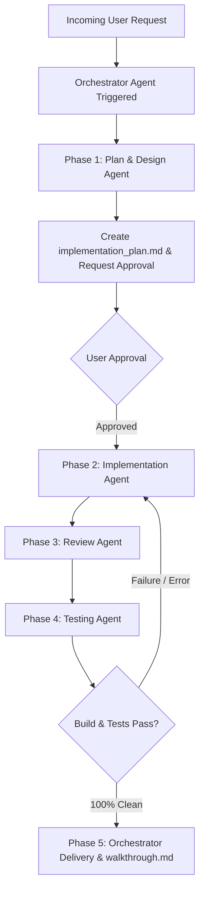

# MotoShop Multi-Agent Operating System

## MANDATORY DIRECTIVE: Orchestrator Agent Trigger on Every Task
**On EVERY task, user request, or bug investigation, the Orchestrator Agent MUST be triggered as the primary entry point.** You must never bypass the Orchestrator or jump straight into writing code without coordinating through the multi-agent development lifecycle.

---

## The 5-Phase Agent Lifecycle

### 1. Phase 1: Plan & Design (`.agents/rules/agent_planner.md`)
- Analyze requirements, bounded contexts, API contracts, and schema implications.
- Generate or update `implementation_plan.md` artifact.
- Stop and wait for user approval before making any code modifications.

### 2. Phase 2: Implementation (`.agents/rules/agent_implementer.md`)
- Execute code modifications according to the approved plan.
- Ensure strict compliance with `architecture.md` and `frontend_style.md`.
- Apply session patterns:
  - Strict PostgreSQL to SQLAlchemy datatype parity (e.g. `Boolean` matches `BOOLEAN`).
  - Schema-qualified enums (`Enum(..., name="job_status", schema="repairs", inherit_schema=True)`).
  - Explicit `text` import for raw SQL statements.
  - Store snapshotting prior to `clearCart()` on checkout/confirmation screens.
  - Dedicated full-page routes for receipts and invoice inspections (`/sales/receipt?id=...`).
  - KrakenD API gateway route synchronization and cookie pass-through (`no-op` output encoding for auth endpoints).
  - Ephemeral in-memory access tokens (`tokenStore`, never in `localStorage`) paired with true browser session cookies (`refresh_token` without `Max-Age`/`Expires`).
  - Dual-timeout session lifecycle (30-minute sliding idle window, 8-hour absolute ceiling in Redis, with RTR reuse detection).
  - Root `document.body` portaling for mobile floating action buttons (`FloatingFilterButton`) and slide-up drawers/modals with safe-area bottom insets (`env(safe-area-inset-bottom)`).
  - Consolidated audit logs strictly housed in Settings (`/settings?tab=logs`) and `/audit-logs` (never scattered as standalone buttons on operational pages).
  - Card-free split-screen login layout directly on the canvas without boxed card enclosures.
  - High-Octane Minimalist Light Theme: Pure white canvas (`#ffffff`), metallic hairline dividers (`#e2e8f0`), deep carbon typography (`#18181b`), and Kawasaki racing lime green accents (`#84cc16`).
  - WCAG AAA Button Text Contrast Invariant: Solid lime green buttons (`bg-lime-500`, `bg-cyan-500`) MUST strictly use bold carbon black text (`#09090b`), yielding contrast > 12:1. White text on lime green is prohibited.
  - 10-Section Official Commercial Invoice Standard: Full-page receipts (`/sales/receipt`) must capture store header & TIN, order metadata, customer & bike profile, staff attribution & commission rates, categorized line items (`[PART]` vs `[SERVICE]`), BIR 12% VAT breakdown, financial settlement, labor commission settlement, warranty terms, and physical signatures.
  - Print Cutoff Prevention Invariant: `@media print` must unconstrain ancestor containers (`html, body, #__next, div, main, section, article { height: auto !important; max-height: none !important; overflow: visible !important; position: static !important; }`) and set dynamic `document.title = "Invoice-" + invoice_no`.
  - Structured CSV Export Parity: Invoices must offer standard RFC 4180 CSV download containing identical 10-section data.
  - Transaction Void Safeguard & Navigation: Irreversible danger `ConfirmModal` (`confirmVariant="danger"`) before voiding sales; single top `< Back to Invoices` navigation without redundant bottom buttons.
  - Public route silent refresh guard: verify `user_role` before firing `/auth/refresh` on `/login` to avoid red 401 console errors.
  - Mobile Repair Board Invariant: Replace Kanban boards on mobile (< md) with Tabbed Status Navigation, dual forward/revert stage buttons with ConfirmModal safeguards, and eliminate redundant top search bars in favor of FloatingFilterButton.
  - Mobile Job Profile Card-Free Invariant: Prohibit boxed card enclosures on mobile (< md); use an edge-to-edge canvas with borderless list rows, subtle dividers, and a sticky 4-tab menu (Overview, Diagnosis, Parts & Services, History).
  - Resilient Identifier Typing: Backend route parameters for entity lookups must use str (not UUID), safely querying UUID, invoice/JO number, and string-cast ID to eliminate 422 errors. Frontend fallbacks must use uuidv4().
  - Strict Light & Dark Mode CSS Separation & Persistence: Prohibit unmount mode rollback in pages/tabs; strictly scope light text remappings under `html:not(.dark)`; enforce explicit dark form controls/tables under `html.dark`; protect BIR white canvas receipts with `:not(:where(.printable-receipt, ...))` zero-specificity exclusions.

### 3. Phase 3: Review (`.agents/rules/agent_reviewer.md`)
- Verify distributed Saga compliance and Transactional Outbox usage.
- Confirm idempotency decorators (`@idempotent`) on state-altering routes.
- Verify RBAC permissions (Cashier vs Manager/Admin access).

### 4. Phase 4: Testing & Verification (`.agents/rules/agent_tester.md`)
- Run `npm run build` in `frontend/` ensuring exit code 0 across all routes.
- Verify microservice container health and inspect logs for tracebacks.
- Test endpoints via KrakenD API Gateway (`http://localhost:8080/api/v1/...`).
- Query PostgreSQL database directly to confirm state persistence.

### 5. Phase 5: Orchestrator Delivery
- Generate or update `walkthrough.md` with visual, code, and verification summaries.
- Deliver a concise final report to the user.
