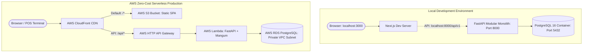

# 🏍️ MotoShop: Motorcycle Shop Management System
> Modern, Enterprise-Grade Point of Sale, Repair Workshop & Inventory Management System

[](https://nextjs.org/)
[](https://fastapi.tiangolo.com/)
[](https://www.postgresql.org/)
[](https://aws.amazon.com/)

---

## 🏗️ Architecture Overview

MotoShop is engineered under a **Dual-Parity Operating Model**:

1. **Local Development (2-Container Docker Stack)**:
   - **Backend**: Single consolidated **FastAPI Modular Monolith** (`motoshop-backend` on port `8000`) with live code reloading.
   - **Database**: Single **PostgreSQL 16** instance (`motoshop-db` on port `5432`) with 5 isolated domain schemas (`auth`, `inventory`, `sales`, `repairs`, `audit`).
   - **Frontend**: **Next.js 16 (Turbopack)** dev server on port `3000` with reactive Zustand state and dark/light dynamic theming.
2. **Production Cloud Deployment ($0.00 / month Base Cost)**:
   - **Frontend**: 100% Static Single-Page Application (SPA) hosted on **Amazon S3** and globally distributed via **AWS CloudFront** edge caching.
   - **Backend**: Containerized FastAPI Modular Monolith executed as an on-demand **AWS Lambda** function via the `Mangum` ASGI adapter behind AWS HTTP API Gateway.
   - **Database**: Managed **AWS RDS PostgreSQL** (`db.t4g.micro`, 20GB gp3 storage) within a private VPC, qualifying under the AWS Free Tier.



---

## 🚀 Quickstart Guide

### Prerequisites
- [Docker Desktop](https://www.docker.com/products/docker-desktop/) (running with WSL2 on Windows or Docker Engine on Linux/macOS)
- [Node.js](https://nodejs.org/) (v18+ recommended)

### 1. Launch Backend & Database (Docker)
In the project root directory, run:
```bash
docker compose up -d
```
This automatically starts:
- `motoshop-db`: PostgreSQL 16 on port `5432`, initialized with all 5 schemas (`init.sql`) and seeded with operational catalog products, bikes, and staff users (`backend/seed_operational_data.sql`).
- `motoshop-backend`: FastAPI Modular Monolith on port `8000` with live code reload.

Verify backend health:
```bash
curl http://localhost:8000/api/v1/health
# Returns: {"status":"healthy","database":"connected"}
```

### 2. Launch Frontend (Next.js)
Open a new terminal window:
```bash
cd frontend
npm install
npm run dev
```
Open **[http://localhost:3000](http://localhost:3000)** in your browser.

---

## 📍 Key System URLs

| Service / Tool | URL | Description |
|---|---|---|
| **Web Application** | [http://localhost:3000](http://localhost:3000) | POS, Workshop, Inventory & Admin Portal |
| **Login Page** | [http://localhost:3000/login](http://localhost:3000/login) | Card-Free Split-Screen JWT Login |
| **API Base URL** | `http://localhost:8000/api/v1` | Consolidated Modular Monolith API |
| **Swagger UI (Interactive API Docs)** | [http://localhost:8000/docs](http://localhost:8000/docs) | Interactive OpenAPI documentation & test runner |
| **OpenAPI Specification** | [http://localhost:8000/openapi.json](http://localhost:8000/openapi.json) | Raw OpenAPI v3 schema JSON |

---

## 🔐 Default Demo Accounts

The database comes pre-seeded with role-provisioned accounts for testing:

| Role | Email | Password | Primary Responsibilities |
|---|---|---|---|
| **Admin** | `admin@motoshop.com` | `admin123` | Full system access, staff provisioning, system settings, void invoices |
| **Cashier** | `cashier@motoshop.com` | `admin123` | Fast POS terminal, transaction checkout, receipt inspections |
| **Mechanic** | `dave.johnson@motoshop.com` | `admin123` | Workshop job cards, repair board, parts usage, commission tracking |
| **Manager** | `manager@motoshop.com` | `admin123` | Operational reporting, stock movements, bike registry, audit logs |

---

## 📦 Core Domain Modules

The backend Modular Monolith is organized into cleanly bounded modules under `backend/app/modules/`:

1. **Auth & Identity (`/api/v1/auth`)**:
   - Ephemeral in-memory access tokens with HttpOnly browser session refresh cookies.
   - Refresh Token Rotation (RTR) with a 15-second grace window to protect against React StrictMode concurrency.
   - User administration, daily wage configuration, and labor commission rates.
2. **Inventory & Stock Management (`/api/v1/inventory`)**:
   - Real-time catalog of motorcycle products (parts, tires, oils) and workshop services.
   - Stock level tracking with automated low-stock warnings and reorder thresholds.
   - Immutable stock movement audit trail.
3. **Repairs & Workshop Operations (`/api/v1/repairs`)**:
   - Bike Registry (`/motorcycles`) with photographic model catalogs.
   - Workshop Kanban & mobile tabbed job cards (`/repairs/board`).
   - Customer Repair History logs (`/repairs/history` and `/repairs/history/logs`).
   - Automatic 40% mechanic labor commission tracking and settlement.
4. **Sales & POS Checkout (`/api/v1/sales`)**:
   - 2-step POS checkout terminal with integrated repair job cart settlement.
   - ACID transaction integrity with immediate stock decrement.
   - 10-section official commercial invoice receipt (`/sales/receipt`) complying with statutory requirements and BIR 12% VAT calculations.
5. **System Audit Trail (`/api/v1/audit`)**:
   - Consolidated audit logs recording sensitive user mutations, logins, price updates, and transaction voids.

---

## 📚 Spec-Driven Development (SDD) Documentation

All architectural decisions, schemas, API contracts, and operational guidelines are strictly governed by the Specification Suite in `docs/specs/`:

- [SPEC-001: System Requirements & Scope](file:///d:/POS/motorcycle-shop-management-system/docs/specs/01-system-requirements-spec.md)
- [SPEC-002: Database Schema & State Management](file:///d:/POS/motorcycle-shop-management-system/docs/specs/02-database-and-state-spec.md)
- [SPEC-003: Unified API Specification](file:///d:/POS/motorcycle-shop-management-system/docs/specs/03-unified-api-spec.md)
- [SPEC-004: Cloud Infrastructure & Serverless CI/CD](file:///d:/POS/motorcycle-shop-management-system/docs/specs/04-infrastructure-and-cicd-spec.md)
- [SPEC-005: Frontend Client Architecture & Static SPA](file:///d:/POS/motorcycle-shop-management-system/docs/specs/05-frontend-client-architecture-spec.md)
- [SPEC-006: Automated Testing & Quality Assurance](file:///d:/POS/motorcycle-shop-management-system/docs/specs/06-testing-and-verification-spec.md)
- [SPEC-007: Operational Runbook & Disaster Recovery](file:///d:/POS/motorcycle-shop-management-system/docs/specs/07-operational-runbook-and-disaster-recovery-spec.md)
- [Master Index & Requirements Traceability Matrix (RTM)](file:///d:/POS/motorcycle-shop-management-system/docs/specs/README.md)

---

## 🛠️ Testing & Verification

Run the automated test suites:

```bash
# Frontend static build & TypeScript verification (must return exit code 0)
cd frontend
npm run build

# Backend asynchronous API integration tests
docker exec motoshop-backend python -m pytest tests/
```
