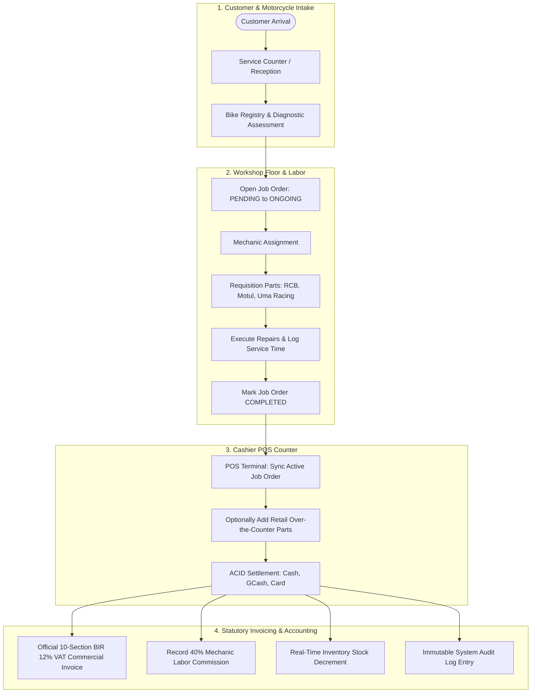
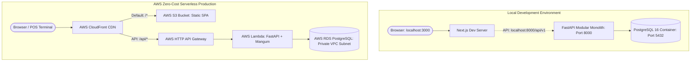

# 🏍️ MotoShop: Motorcycle Shop Management System
> Modern, Enterprise-Grade Point of Sale, Repair Workshop & Inventory Management System

[](https://nextjs.org/)
[](https://fastapi.tiangolo.com/)
[](https://www.postgresql.org/)
[](https://aws.amazon.com/)

---

## 📖 System Overview

**MotoShop** is a modern, enterprise-grade Point of Sale (POS), Workshop Job Order management, and Inventory platform purpose-built for physical motorcycle service centers, repair garages, and aftermarket performance parts retailers in the Philippines.

Designed for physical shops operating with up to **5 concurrent internal team members** (Shop Owner/Manager, Cashiers, and Mechanics), MotoShop bridges the critical operational gap between the workshop service floor and the cashier checkout counter. It eliminates paper job tickets, untracked parts requisitions, disputed mechanic labor commissions, and manual VAT accounting with an all-in-one, real-time operating system.

### 🌟 Core Value Propositions

| Pillar | Capability & Business Value |
|---|---|
| 💸 **$0.00 / Month Serverless Cloud Cost** | Architected for zero baseline hosting expense using the **AWS Free Tier** (Next.js SPA on S3/CloudFront, containerized FastAPI on AWS Lambda via Mangum, and private RDS PostgreSQL `db.t4g.micro`). |
| ⚡ **Workshop-to-Register Flow** | Completed repair jobs synchronize directly with the cashier POS terminal in real time. Labor charges and installed parts are consolidated into a single ACID transaction with instant inventory decrement. |
| 🔧 **40% Mechanic Labor Commission Tracking** | Automated, dispute-free labor commission calculation built directly into job order lifecycles, ensuring transparent payroll tracking and mechanic accountability. |
| 🇵🇭 **Statutory BIR 12% VAT Compliance** | Generates official **10-Section Commercial Invoices** (`/sales/receipt`) with statutory BIR 12% VAT calculations (VATable sales, VAT-exempt sales, VAT amount), business TIN, and isolated single-page A4 printing. |
| 🏍️ **Philippine Motorcycle Catalog** | Out-of-the-box photographic bike registry and inventory catalog tailored for popular Philippine motorcycles (*Yamaha NMAX 155, Honda Click 125i/160, Suzuki Raider R150 Fi, Yamaha Sniper 155, Honda ADV 160*) and leading aftermarket brands (*RCB, Uma Racing, Motul 7100, JVT, Maxxis*). |
| 📱 **Mobile-First Shop Floor Usability** | Optimized for mechanics holding phones or tablets on the shop floor—featuring touch-friendly tabbed repair boards, 2-column POS product grids, and floating action buttons with safe-area insets. |

### 🔄 End-to-End Operational Lifecycle

The diagram below illustrates the end-to-end operational journey across the shop's key roles—from motorcycle intake to cashier checkout and BIR statutory compliance:


```mermaid
flowchart TD
    subgraph Intake [1. Customer & Motorcycle Intake]
        Customer([Customer Arrival]) --> Desk[Service Counter / Reception]
        Desk --> BikeReg[Bike Registry & Diagnostic Assessment]
    end

    subgraph Workshop [2. Workshop Floor & Labor]
        BikeReg --> JobOrder[Open Job Order: PENDING to ONGOING]
        JobOrder --> Mechanic[Mechanic Assignment]
        Mechanic --> PartsReq[Requisition Parts: RCB, Motul, Uma Racing]
        PartsReq --> RepairLabor[Execute Repairs & Log Service Time]
        RepairLabor --> CompleteJob[Mark Job Order COMPLETED]
    end

    subgraph POS_Counter [3. Cashier POS Counter]
        CompleteJob --> POSSync[POS Terminal: Sync Active Job Order]
        POSSync --> RetailItems[Optionally Add Retail Over-the-Counter Parts]
        RetailItems --> Checkout[ACID Settlement: Cash, GCash, Card]
    end

    subgraph Settlement [4. Statutory Invoicing & Accounting]
        Checkout --> BIRInvoice[Official 10-Section BIR 12% VAT Commercial Invoice]
        Checkout --> CommissionLedger[Record 40% Mechanic Labor Commission]
        Checkout --> StockAudit[Real-Time Inventory Stock Decrement]
        Checkout --> SystemLog[Immutable System Audit Log Entry]
    end
```

---

## 🏗️ Architecture Overview

MotoShop is engineered under a **Dual-Parity Operating Model**:

1. **Local Development (2-Container Docker Stack)**:
   - **Backend**: Single consolidated **FastAPI Modular Monolith** (`motoshop-backend` on port `8000`) with live code reloading.
   - **Database**: Single **PostgreSQL 16** instance (`motoshop-db` on port `5432`) with 5 isolated domain schemas (`auth`, `inventory`, `sales`, `repairs`, `audit`).
   - **Frontend**: **Next.js 16 (Turbopack)** dev server on port `3000` with reactive Zustand state and dark/light dynamic theming.
2. **Production Cloud Deployment ($0.00 / month Base Cost)**:
   - **Frontend**: 100% Static Single-Page Application (SPA) hosted on **Amazon S3** and globally distributed via **AWS CloudFront** edge caching.
   - **Backend**: Containerized FastAPI Modular Monolith executed as an on-demand **AWS Lambda** function via the `Mangum` ASGI adapter behind AWS HTTP API Gateway.
   - **Database**: Managed **AWS RDS PostgreSQL** (`db.t4g.micro`, 20GB gp3 storage) within a private VPC, qualifying under the AWS Free Tier.


```mermaid
flowchart TD
    subgraph Local_Dev [Local Development Environment]
        Browser_Dev([Browser: localhost:3000]) --> NextDev[Next.js Dev Server]
        NextDev -.->|API: localhost:8000/api/v1| FastApi_Dev[FastAPI Modular Monolith: Port 8000]
        FastApi_Dev --> Postgres_Dev[(PostgreSQL 16 Container: Port 5432)]
    end

    subgraph AWS_Production [AWS Zero-Cost Serverless Production]
        User_Prod([Browser / POS Terminal]) --> CloudFront[AWS CloudFront CDN]
        CloudFront -->|Default: /*| S3[AWS S3 Bucket: Static SPA]
        CloudFront -->|API: /api/*| ApiGw[AWS HTTP API Gateway]
        ApiGw --> Lambda[AWS Lambda: FastAPI + Mangum]
        Lambda --> RDS[(AWS RDS PostgreSQL: Private VPC Subnet)]
    end
```

---

## 🚀 Quickstart Guide

### Prerequisites
- [Docker Desktop](https://www.docker.com/products/docker-desktop/) (running with WSL2 on Windows or Docker Engine on Linux/macOS)
- [Node.js](https://nodejs.org/) (v18+ recommended)

### 1. Launch Backend & Database (Docker)
In the project root directory, run:
```bash
docker compose up -d
```
This automatically starts:
- `motoshop-db`: PostgreSQL 16 on port `5432`, initialized with all 5 schemas (`init.sql`) and seeded with operational catalog products, bikes, and staff users (`backend/seed_operational_data.sql`).
- `motoshop-backend`: FastAPI Modular Monolith on port `8000` with live code reload.

Verify backend health:
```bash
curl http://localhost:8000/api/v1/health
# Returns: {"status":"healthy","database":"connected"}
```

### 2. Launch Frontend (Next.js)
Open a new terminal window:
```bash
cd frontend
npm install
npm run dev
```
Open **[http://localhost:3000](http://localhost:3000)** in your browser.

---

## 📍 Key System URLs

| Service / Tool | URL | Description |
|---|---|---|
| **Web Application** | [http://localhost:3000](http://localhost:3000) | POS, Workshop, Inventory & Admin Portal |
| **Login Page** | [http://localhost:3000/login](http://localhost:3000/login) | Card-Free Split-Screen JWT Login |
| **API Base URL** | `http://localhost:8000/api/v1` | Consolidated Modular Monolith API |
| **Swagger UI (Interactive API Docs)** | [http://localhost:8000/docs](http://localhost:8000/docs) | Interactive OpenAPI documentation & test runner |
| **OpenAPI Specification** | [http://localhost:8000/openapi.json](http://localhost:8000/openapi.json) | Raw OpenAPI v3 schema JSON |

---

## 🔐 Default Demo Accounts

The database comes pre-seeded with role-provisioned accounts for testing:

| Role | Email | Password | Primary Responsibilities |
|---|---|---|---|
| **Admin** | `admin@motoshop.com` | `admin123` | Full system access, staff provisioning, system settings, void invoices |
| **Cashier** | `cashier@motoshop.com` | `admin123` | Fast POS terminal, transaction checkout, receipt inspections |
| **Mechanic** | `dave.johnson@motoshop.com` | `admin123` | Workshop job cards, repair board, parts usage, commission tracking |
| **Manager** | `manager@motoshop.com` | `admin123` | Operational reporting, stock movements, bike registry, audit logs |

---

## 📦 Core Domain Modules

The backend Modular Monolith is organized into cleanly bounded modules under `backend/app/modules/`:

1. **Auth & Identity (`/api/v1/auth`)**:
   - Ephemeral in-memory access tokens with HttpOnly browser session refresh cookies.
   - Refresh Token Rotation (RTR) with a 15-second grace window to protect against React StrictMode concurrency.
   - User administration, daily wage configuration, and labor commission rates.
2. **Inventory & Stock Management (`/api/v1/inventory`)**:
   - Real-time catalog of motorcycle products (parts, tires, oils) and workshop services.
   - Stock level tracking with automated low-stock warnings and reorder thresholds.
   - Immutable stock movement audit trail.
3. **Repairs & Workshop Operations (`/api/v1/repairs`)**:
   - Bike Registry (`/motorcycles`) with photographic model catalogs.
   - Workshop Kanban & mobile tabbed job cards (`/repairs/board`).
   - Customer Repair History logs (`/repairs/history` and `/repairs/history/logs`).
   - Automatic 40% mechanic labor commission tracking and settlement.
4. **Sales & POS Checkout (`/api/v1/sales`)**:
   - 2-step POS checkout terminal with integrated repair job cart settlement.
   - ACID transaction integrity with immediate stock decrement.
   - 10-section official commercial invoice receipt (`/sales/receipt`) complying with statutory requirements and BIR 12% VAT calculations.
5. **System Audit Trail (`/api/v1/audit`)**:
   - Consolidated audit logs recording sensitive user mutations, logins, price updates, and transaction voids.

---

## 📚 Spec-Driven Development (SDD) Documentation

All architectural decisions, schemas, API contracts, and operational guidelines are strictly governed by the Specification Suite in `docs/specs/`:

- [SPEC-001: System Requirements & Scope](file:///d:/POS/motorcycle-shop-management-system/docs/specs/01-system-requirements-spec.md)
- [SPEC-002: Database Schema & State Management](file:///d:/POS/motorcycle-shop-management-system/docs/specs/02-database-and-state-spec.md)
- [SPEC-003: Unified API Specification](file:///d:/POS/motorcycle-shop-management-system/docs/specs/03-unified-api-spec.md)
- [SPEC-004: Cloud Infrastructure & Serverless CI/CD](file:///d:/POS/motorcycle-shop-management-system/docs/specs/04-infrastructure-and-cicd-spec.md)
- [SPEC-005: Frontend Client Architecture & Static SPA](file:///d:/POS/motorcycle-shop-management-system/docs/specs/05-frontend-client-architecture-spec.md)
- [SPEC-006: Automated Testing & Quality Assurance](file:///d:/POS/motorcycle-shop-management-system/docs/specs/06-testing-and-verification-spec.md)
- [SPEC-007: Operational Runbook & Disaster Recovery](file:///d:/POS/motorcycle-shop-management-system/docs/specs/07-operational-runbook-and-disaster-recovery-spec.md)
- [Master Index & Requirements Traceability Matrix (RTM)](file:///d:/POS/motorcycle-shop-management-system/docs/specs/README.md)

---

## 🛠️ Testing, Quality Assurance & Security

MotoShop features a multi-tier testing framework guaranteeing functional reliability, zero regression, and strict zero-tolerance security enforcement:

### 1. Backend Domain Test Suite (43 Tests)
Runs against live PostgreSQL schemas with isolated connection pool lifecycles across all 6 core business domains:
```bash
# Run from repository root or frontend/
npm run test:backend

# Or directly inside the running Docker container
docker exec motoshop-backend pytest -v
```
- **Auth & Session Lifecycle** (`test_auth.py`): 9 tests
- **Catalog & Inventory** (`test_inventory.py`): 8 tests
- **Repairs & Workshop Jobs** (`test_repairs.py`): 6 tests
- **Sales & ACID POS Checkout** (`test_sales.py`): 5 tests
- **Audit Logs & CSV Export** (`test_audit.py`): 4 tests
- **RBAC Security Boundaries** (`test_rbac_security.py`): 7 tests
- **Modular Monolith E2E** (`test_modular_monolith.py`): 4 tests

### 2. Pre-Flight Security Gate
Enforces strict zero-tolerance checks for known CVEs, code security flaws, and leaked credentials:
```bash
npm run test:security
```
- **Frontend Dependency Audit**: `npm audit --audit-level=high` (0 vulnerabilities).
- **Backend SAST**: Bandit scanning `backend/app/` for Medium and High severity code flaws.
- **Python Dependency Audit**: `pip-audit` validating `requirements.txt` against PyPA advisories.
- **Secret Scanning**: Gitleaks configured via `.gitleaks.toml`.

### 3. End-to-End & Mobile Usability Verification (40 Playwright Tests)
Validates responsive layouts, mobile touch usability, WCAG AAA text contrast, and decoupled printing:
```bash
npm run test:e2e
```
- **Desktop & Mobile Breakpoints**: Responsive 2-column POS grid and edge-to-edge mobile list rows.
- **Unified Floating Action Buttons (FAB)**: 56×56px emerald Add FAB and Filter FAB portaled to `document.body` with safe-area insets.
- **Destructive Safeguards**: Danger `ConfirmModal` gating sales voiding and entity deletions.
- **Decoupled A4 Print Sandbox**: Ephemeral iframe printing preventing dark mode styles from leaking onto official receipts.

### 4. Production Static Build
```bash
npm run build
```
Compiles all 29 routes as static SPA pages with static params and client-side hydration.

