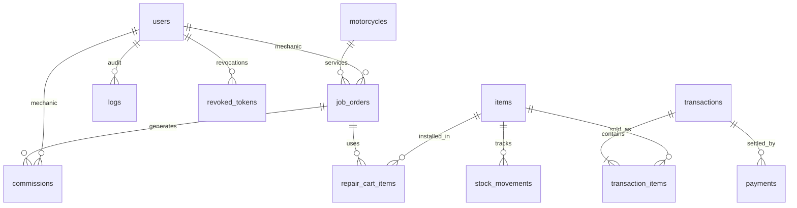

# MotoShop POS: Database & State Specification
## Document ID: SPEC-002 | Version: 1.0.0-PROD | Status: APPROVED

---

## 1. Relational Database Architecture

The system uses **AWS RDS PostgreSQL (`db.t4g.micro`)** with multi-schema logical partitioning.



---

## 2. PostgreSQL Schemas

The database partitions tables into 5 business schemas:
1. `auth`: Users, credentials, permissions, session tokens, and idempotency store.
2. `inventory`: Catalog items, stock levels, stock movement history.
3. `sales`: Transactions, invoices, item lines, payment records.
4. `repairs`: Motorcycle registry, job orders, repair cart parts, mechanic commissions.
5. `audit`: Immutable audit logs and security events.

---

## 3. Detailed Table Definitions & SQL DDL

### 3.1 `auth` Schema

#### `auth.users`
```sql
CREATE TABLE auth.users (
    id UUID PRIMARY KEY DEFAULT gen_random_uuid(),
    first_name VARCHAR(100) NOT NULL DEFAULT '',
    last_name VARCHAR(100) NOT NULL DEFAULT '',
    email VARCHAR(255) UNIQUE NOT NULL,
    password_hash VARCHAR(255) NOT NULL,
    role VARCHAR(50) NOT NULL DEFAULT 'cashier',
    token_version INTEGER NOT NULL DEFAULT 1,
    commission_rate NUMERIC(5, 2) DEFAULT 40.0,
    base_wage NUMERIC(10, 2) DEFAULT 650.0,
    avatar VARCHAR(50) NOT NULL DEFAULT 'avatar-1',
    created_at TIMESTAMP WITH TIME ZONE DEFAULT CURRENT_TIMESTAMP
);
CREATE INDEX idx_users_email ON auth.users(email);
```

#### `auth.revoked_tokens` (Replaces Redis Token Blacklist)
```sql
CREATE TABLE auth.revoked_tokens (
    token_jti VARCHAR(255) PRIMARY KEY,
    user_id UUID REFERENCES auth.users(id) ON DELETE CASCADE,
    expires_at TIMESTAMP WITH TIME ZONE NOT NULL,
    revoked_at TIMESTAMP WITH TIME ZONE DEFAULT CURRENT_TIMESTAMP
);
CREATE INDEX idx_revoked_tokens_expires ON auth.revoked_tokens(expires_at);
```

#### `auth.idempotency_keys` (Replaces Redis Distributed Lock)
```sql
CREATE TABLE auth.idempotency_keys (
    key VARCHAR(128) PRIMARY KEY,
    user_id UUID REFERENCES auth.users(id) ON DELETE SET NULL,
    endpoint VARCHAR(255) NOT NULL,
    request_hash VARCHAR(64) NOT NULL,
    response_code INT NOT NULL,
    response_body JSONB NOT NULL,
    created_at TIMESTAMP WITH TIME ZONE DEFAULT CURRENT_TIMESTAMP,
    expires_at TIMESTAMP WITH TIME ZONE NOT NULL
);
CREATE INDEX idx_idempotency_expires ON auth.idempotency_keys(expires_at);
```

---

### 3.2 `inventory` Schema

#### `inventory.items`
```sql
CREATE TYPE inventory.item_type AS ENUM ('PRODUCT', 'SERVICE');

CREATE TABLE inventory.items (
    id UUID PRIMARY KEY DEFAULT gen_random_uuid(),
    sku VARCHAR(100) UNIQUE NOT NULL,
    name VARCHAR(255) NOT NULL,
    brand VARCHAR(100),
    item_type inventory.item_type NOT NULL DEFAULT 'PRODUCT',
    category VARCHAR(100),
    current_stock INTEGER NOT NULL DEFAULT 0,
    reorder_level INTEGER NOT NULL DEFAULT 5,
    cost_price NUMERIC(10, 2) NOT NULL,
    selling_price NUMERIC(10, 2) NOT NULL,
    is_active BOOLEAN NOT NULL DEFAULT TRUE
);
CREATE INDEX idx_items_sku ON inventory.items(sku);
CREATE INDEX idx_items_category ON inventory.items(category);
```

#### `inventory.stock_movements`
```sql
CREATE TYPE inventory.movement_type AS ENUM ('IN', 'OUT', 'SALE', 'REPAIR');

CREATE TABLE inventory.stock_movements (
    id UUID PRIMARY KEY DEFAULT gen_random_uuid(),
    item_id UUID REFERENCES inventory.items(id) ON DELETE RESTRICT,
    type inventory.movement_type NOT NULL,
    quantity_changed INTEGER NOT NULL,
    new_quantity INTEGER NOT NULL,
    reference_id UUID,
    created_at TIMESTAMP WITH TIME ZONE DEFAULT CURRENT_TIMESTAMP
);
CREATE INDEX idx_stock_movements_item ON inventory.stock_movements(item_id);
```

---

### 3.3 `sales` Schema

#### `sales.transactions`
```sql
CREATE TYPE sales.transaction_status AS ENUM ('PENDING', 'COMPLETED', 'VOIDED');

CREATE TABLE sales.transactions (
    id UUID PRIMARY KEY DEFAULT gen_random_uuid(),
    invoice_no VARCHAR(100) UNIQUE NOT NULL,
    customer_id UUID,
    cashier_name VARCHAR(255),
    mechanic_name VARCHAR(255),
    job_order_id UUID,
    subtotal NUMERIC(10, 2) NOT NULL DEFAULT 0,
    discount_percentage NUMERIC(5, 2) NOT NULL DEFAULT 0,
    discount_amount NUMERIC(10, 2) NOT NULL DEFAULT 0,
    total NUMERIC(10, 2) NOT NULL DEFAULT 0,
    amount_paid NUMERIC(10, 2) NOT NULL DEFAULT 0,
    cash_received NUMERIC(10, 2) NOT NULL DEFAULT 0,
    cash_change NUMERIC(10, 2) NOT NULL DEFAULT 0,
    status sales.transaction_status NOT NULL DEFAULT 'PENDING',
    created_at TIMESTAMP WITH TIME ZONE DEFAULT CURRENT_TIMESTAMP
);
CREATE INDEX idx_transactions_invoice_no ON sales.transactions(invoice_no);
CREATE INDEX idx_transactions_created_at ON sales.transactions(created_at);
```

#### `sales.transaction_items`
```sql
CREATE TABLE sales.transaction_items (
    id UUID PRIMARY KEY DEFAULT gen_random_uuid(),
    transaction_id UUID REFERENCES sales.transactions(id) ON DELETE CASCADE,
    item_id VARCHAR(100) NOT NULL,
    qty INTEGER NOT NULL,
    price NUMERIC(10, 2) NOT NULL
);
```

#### `sales.payments`
```sql
CREATE TABLE sales.payments (
    id UUID PRIMARY KEY DEFAULT gen_random_uuid(),
    transaction_id UUID REFERENCES sales.transactions(id) ON DELETE CASCADE,
    amount NUMERIC(10, 2) NOT NULL,
    method VARCHAR(50) NOT NULL,
    created_at TIMESTAMP WITH TIME ZONE DEFAULT CURRENT_TIMESTAMP
);
```

---

### 3.4 `repairs` Schema

#### `repairs.motorcycles`
```sql
CREATE TABLE repairs.motorcycles (
    id UUID PRIMARY KEY DEFAULT gen_random_uuid(),
    plate_number VARCHAR(50) UNIQUE NOT NULL,
    brand VARCHAR(100) NOT NULL,
    model VARCHAR(100) NOT NULL,
    year INTEGER,
    color VARCHAR(50),
    engine_number VARCHAR(100),
    chassis_number VARCHAR(100),
    customer_name VARCHAR(255) NOT NULL,
    customer_contact VARCHAR(50),
    notes TEXT,
    created_at TIMESTAMP WITH TIME ZONE DEFAULT CURRENT_TIMESTAMP,
    updated_at TIMESTAMP WITH TIME ZONE DEFAULT CURRENT_TIMESTAMP
);
CREATE INDEX idx_motorcycles_plate ON repairs.motorcycles(plate_number);
CREATE INDEX idx_motorcycles_customer ON repairs.motorcycles(customer_name);
```

#### `repairs.job_orders`
```sql
CREATE TYPE repairs.job_status AS ENUM ('PENDING', 'ONGOING', 'COMPLETED', 'RELEASED');

CREATE TABLE repairs.job_orders (
    id UUID PRIMARY KEY DEFAULT gen_random_uuid(),
    jo_number VARCHAR(100) UNIQUE NOT NULL,
    customer_id UUID,
    customer_name VARCHAR(255),
    motorcycle_id VARCHAR(100),
    mechanic_id UUID REFERENCES auth.users(id),
    mechanic_name VARCHAR(255),
    mechanic_notes TEXT,
    labor_charge NUMERIC(10, 2) NOT NULL DEFAULT 0,
    parts_charge NUMERIC(10, 2) NOT NULL DEFAULT 0,
    is_paid BOOLEAN NOT NULL DEFAULT FALSE,
    payment_status VARCHAR(50) NOT NULL DEFAULT 'UNPAID',
    status repairs.job_status NOT NULL DEFAULT 'PENDING',
    created_at TIMESTAMP WITH TIME ZONE DEFAULT CURRENT_TIMESTAMP
);
CREATE INDEX idx_job_orders_jo_no ON repairs.job_orders(jo_number);
CREATE INDEX idx_job_orders_status ON repairs.job_orders(status);
```

#### `repairs.repair_cart_items`
```sql
CREATE TABLE repairs.repair_cart_items (
    id UUID PRIMARY KEY DEFAULT gen_random_uuid(),
    job_order_id UUID REFERENCES repairs.job_orders(id) ON DELETE CASCADE,
    item_id UUID,
    item_name VARCHAR(255) NOT NULL,
    item_type VARCHAR(50) NOT NULL DEFAULT 'PRODUCT',
    qty INTEGER NOT NULL DEFAULT 1,
    unit_price NUMERIC(10, 2) NOT NULL,
    total_price NUMERIC(10, 2) NOT NULL,
    created_at TIMESTAMP WITH TIME ZONE DEFAULT CURRENT_TIMESTAMP
);
```

#### `repairs.commissions`
```sql
CREATE TABLE repairs.commissions (
    id UUID PRIMARY KEY DEFAULT gen_random_uuid(),
    job_order_id UUID REFERENCES repairs.job_orders(id) ON DELETE CASCADE,
    mechanic_id UUID REFERENCES auth.users(id) ON DELETE RESTRICT,
    labor_base NUMERIC(10, 2) NOT NULL,
    rate_percentage NUMERIC(5, 2) NOT NULL,
    amount_earned NUMERIC(10, 2) NOT NULL,
    created_at TIMESTAMP WITH TIME ZONE DEFAULT CURRENT_TIMESTAMP
);
```

---

### 3.5 `audit` Schema

#### `audit.logs` & Immutability Trigger
```sql
CREATE TABLE audit.logs (
    id UUID PRIMARY KEY DEFAULT gen_random_uuid(),
    timestamp TIMESTAMP WITH TIME ZONE DEFAULT CURRENT_TIMESTAMP,
    user_id UUID REFERENCES auth.users(id) ON DELETE SET NULL,
    user_role VARCHAR(50),
    action VARCHAR(100) NOT NULL,
    resource VARCHAR(255) NOT NULL,
    details JSONB,
    ip_address VARCHAR(45)
);

CREATE OR REPLACE FUNCTION audit.prevent_audit_log_modification()
RETURNS TRIGGER AS $$
BEGIN
    IF TG_OP = 'DELETE' THEN
        RAISE EXCEPTION 'Audit log entries are immutable and cannot be deleted.';
    ELSIF TG_OP = 'UPDATE' THEN
        IF OLD.action <> NEW.action OR 
           OLD.resource <> NEW.resource OR 
           OLD.timestamp <> NEW.timestamp OR 
           OLD.ip_address IS DISTINCT FROM NEW.ip_address OR 
           OLD.user_role IS DISTINCT FROM NEW.user_role OR
           OLD.details IS DISTINCT FROM NEW.details OR
           (OLD.user_id IS NOT NULL AND NEW.user_id IS NOT NULL AND OLD.user_id <> NEW.user_id) THEN
            RAISE EXCEPTION 'Audit log entries are immutable and cannot be updated.';
        END IF;
    END IF;
    RETURN NEW;
END;
$$ LANGUAGE plpgsql;

CREATE TRIGGER trg_audit_logs_immutable
BEFORE UPDATE OR DELETE ON audit.logs
FOR EACH ROW EXECUTE FUNCTION audit.prevent_audit_log_modification();
```

---

## 4. ACID Transaction Workflow (Replacing Saga Pattern)

### POS Checkout Transaction Invariant:
When a checkout is committed:
```python
async with session.begin():
    # 1. Check Idempotency Key
    existing = await get_idempotency_key(session, key)
    if existing:
        return existing.response

    # 2. Insert Transaction Record
    trans = Transaction(invoice_no=..., total=..., ...)
    session.add(trans)
    await session.flush()

    # 3. For each item in cart:
    for item in cart_items:
        # Deduct stock if item is PRODUCT
        if item.item_type == "PRODUCT":
            db_item = await get_item_with_lock(session, item.id)
            if db_item.current_stock < item.qty:
                raise InsufficientStockError(db_item.name)
            db_item.current_stock -= item.qty
            session.add(StockMovement(item_id=db_item.id, type="SALE", ...))
        
        session.add(TransactionItem(transaction_id=trans.id, ...))

    # 4. If linked to Job Order, update status to COMPLETED/RELEASED and record Commission
    if job_order_id:
        jo = await get_job_order(session, job_order_id)
        jo.is_paid = True
        jo.status = "RELEASED"
        session.add(Commission(job_order_id=jo.id, mechanic_id=jo.mechanic_id, ...))

    # 5. Save Idempotency record
    session.add(IdempotencyKey(key=key, response_code=201, ...))
```
If any error occurs, the entire transaction rolls back cleanly via standard PostgreSQL ACID guarantees.
