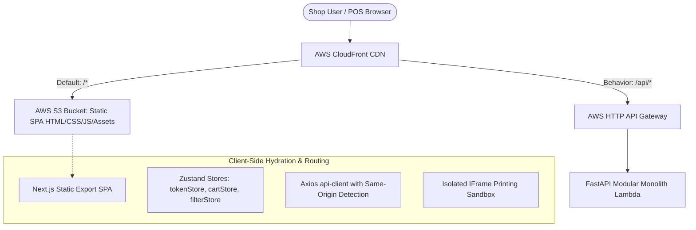

# MotoShop POS: Frontend Client Architecture & Static SPA Specification
## Document ID: SPEC-005 | Version: 1.0.0-PROD | Status: READY

---

## 1. Architecture Overview

The MotoShop POS frontend is engineered as a zero-compute-cost **Static Single-Page Application (SPA)** built with **Next.js 16 (Turbopack)**, **Tailwind CSS**, and **Zustand**. 

Hosted on **Amazon S3** and distributed globally via **AWS CloudFront**, the frontend incurs **$0.00 / month** in hosting and compute costs under the AWS Always Free Tier.



---

## 2. Static Export Configuration & Routing Architecture

### 2.1 Static Build Configuration (`next.config.ts`)
The application is configured to generate static HTML for production deployment while permitting dynamic server routing in local development:
```typescript
import type { NextConfig } from "next";

const nextConfig: NextConfig = {
  // Enable static export exclusively during production builds, permitting dynamic routes in dev
  ...(process.env.NODE_ENV === 'production' ? { output: 'export' } : {}),
  images: {
    unoptimized: true,
  },
  trailingSlash: true,
};

export default nextConfig;
```

### 2.2 Client-Side Hydration for Dynamic Routes
Because static export does not support dynamic server-side rendering (SSR), dynamic URL segments are resolved on the client using a dual strategy:
1. **Fallback Prerendering via `generateStaticParams`**:
   Dynamic routes prerender a default `/preview/` artifact during `next build`:
   - `/inventory/[id]/page.tsx` $\to$ `/inventory/preview/`
   - `/repairs/jobs/[id]/page.tsx` $\to$ `/repairs/jobs/preview/`
   - `/users/[id]/page.tsx` $\to$ `/users/preview/`
2. **Client-Side Parameter Resolution**:
   Client page components (`InventoryDetailPageClient`, `JobDetailPageClient`, `UserDetailPageClient`) inspect both Next.js route params and browser query parameters (`?id=...` or window path extraction):
   ```typescript
   // Resilient ID extraction supporting both path and query parameters
   const searchParams = useSearchParams();
   const queryId = searchParams.get('id');
   const effectiveId = queryId || params.id;
   ```
3. **Dedicated Full-Page Receipt Route**:
   Official BIR commercial invoice receipts are served via `/sales/receipt?id=...`, which loads transaction data client-side and mounts printable document layouts.

---

## 3. Single-Origin CloudFront Routing (Zero-CORS Invariant)

### 3.1 Transparent Dual-Mode API Client (`frontend/src/lib/api-client.ts`)
The Axios client automatically adapts between cloud production and local development environments, complete with a single-flight mutex (`refreshTokenOnce`) to deduplicate concurrent `/auth/refresh` attempts:
```typescript
const API_GATEWAY_URL =
  process.env.NEXT_PUBLIC_API_URL ||
  (typeof window !== 'undefined' &&
   window.location.hostname !== 'localhost' &&
   window.location.hostname !== '127.0.0.1'
    ? '/api/v1'
    : 'http://localhost:8000/api/v1');

export const apiClient = axios.create({
  baseURL: API_GATEWAY_URL,
  withCredentials: true, // Passes HttpOnly refresh cookies
  headers: {
    'Content-Type': 'application/json',
  },
});
```
* **Production Advantage**: Requests to `/api/v1/*` route through the same CloudFront origin. This completely eliminates HTTP `OPTIONS` preflight requests, halving API latency and saving ~25,000 Lambda invocations/month.
* **Local Parity**: Seamlessly connects to the FastAPI Modular Monolith backend on `http://localhost:8000/api/v1`.
* **Refresh Concurrency Mutex**: `refreshTokenOnce()` deduplicates simultaneous token expiration refreshes across parallel component calls, while a 15-second grace window on the backend prevents false token reuse detection under React StrictMode.

---

## 4. Client State & Security Invariants

### 4.1 In-Memory Access Token Store (`tokenStore`)
To prevent Cross-Site Scripting (XSS) credential theft, access tokens are **NEVER** stored in `localStorage` or `sessionStorage`:
- **Storage**: Ephemeral JavaScript memory in `tokenStore` (`frontend/src/lib/auth-token.ts`).
- **Persistence**: Long-lived sessions rely exclusively on the `refresh_token` stored in an `HttpOnly; SameSite=Lax; Secure` cookie managed by the browser.
- **Silent Refresh**: On initial page load, `apiClient` requests `/auth/refresh` to rehydrate memory. On public routes (`/login`), the refresh attempt is guarded to prevent noisy 401 console logs.

### 4.2 Checkout State Snapshotting Prior to `clearCart()`
To prevent empty invoice screen states when users complete a sale:
```typescript
// Capture immutable state snapshot before store purge
const checkoutSnapshot = {
  invoice_no: response.data.invoice_no,
  items: [...cartItems],
  total: cartTotal,
  settlement: { ...paymentDetails }
};
clearCart(); // Safe to purge active cart
navigateToReceipt(checkoutSnapshot);
```

---

## 5. UI Design System & Component Hierarchy

### 5.1 High-Octane Minimalist Light & Dark Mode Separation
The UI adheres strictly to dual-theme integrity without CSS bleeding:
* **Light Theme (Default Canvas)**:
  - Canvas: Pure white (`#ffffff`)
  - Hairline Dividers: Metallic slate (`#e2e8f0` / `border-zinc-200`)
  - Typography: Deep carbon black (`#18181b` / `text-zinc-900`)
  - Primary Accents: Kawasaki racing lime green (`#84cc16` / `bg-lime-500`)
* **Dark Theme (`html.dark`)**:
  - Canvas: Deep carbon black (`#09090b` / `bg-zinc-950`)
  - Surface Cards: Subtle dark slate (`#18181b` / `bg-zinc-900`)
  - Typography: Crisp white (`#f4f4f5` / `text-zinc-100`)
* **WCAG AAA Text Contrast Invariant**:
  - Lime green and cyan accent buttons (`bg-lime-500`, `bg-cyan-500`) MUST strictly use bold black text (`#09090b`), achieving > 12:1 contrast. White text on lime green is strictly prohibited.

### 5.2 Mobile POS Layout & Floating Filter FAB Invariant
On mobile devices (`< md` screen widths):
1. **2-Column Product Grid**: Active repair cards and inventory items render in a compact 2-column layout (`grid-cols-2 gap-2.5`).
2. **Floating Action Button (`FloatingFilterFab`)**:
   - An unlabelled circular filter button (`data-testid="pos-mobile-filter-fab"`) is portaled directly to `document.body` above the cart FAB.
   - Summons the `MobilePosFilterSheet` slide-up drawer for real-time search, category filtering, and item type switching (`PRODUCT` vs `SERVICE`).
   - Respects mobile safe-area insets (`env(safe-area-inset-bottom)`).

### 5.3 Mobile Repair Board Invariant
- Replaces desktop drag-and-drop Kanban boards with **Tabbed Status Navigation** (`Pending`, `Ongoing`, `Completed`, `Released`).
- Forward and Revert stage buttons are protected with `ConfirmModal` safeguards to prevent accidental status advancements on touchscreens.

### 5.4 Master Directory Table & Clean Row Action Invariant
Master entity registries (Bike Registry `/motorcycles`, Customer Records `/repairs/history`, Inventory `/inventory`, Users `/users`) maintain 100% behavioral parity:
1. **Clean Row Interaction (Chevron-Only)**: Table rows must NOT contain inline edit/delete icon buttons (Pencil/Trash2). Rows are fully clickable, concluding with an animated `ChevronRight` and hover label (`Edit Profile` or `View Profile`).
2. **Modal-Housed Destructive Actions**: Delete and Archive buttons reside strictly inside the entity's Edit modal footer on the left (`sm:justify-between`), prompting an irreversible `ConfirmModal` danger safeguard before executing.
3. **Mobile Card-Free Parity (< md)**: Boxed card enclosures are replaced with edge-to-edge borderless list rows using `divide-y divide-zinc-800/80 pb-24`.
4. **Desktop Footer Parity**: Table containers feature a fixed bottom footer with real-time record count (`Showing X record(s)`) and role accessibility permissions.

---

## 6. Decoupled Printable Document Invariant

Official commercial invoices (`/sales/receipt`) and payslips (`/payroll/payslip`) must strictly isolate print markup from in-app UI:

```
frontend/src/components/documents/
├── PrintableInvoiceDocument.tsx   # 10-section BIR commercial invoice layout
├── PrintablePayslipDocument.tsx   # Bi-weekly mechanic labor & wage slip
└── printUtils.ts                  # Isolated iframe sandbox print runner
```

1. **In-App Screen UI**: Strictly retains dark mode theme (`bg-zinc-950`, `text-zinc-100`) without raw white document boxes visible on display. Marked with `print:hidden`.
2. **Isolated IFrame Sandbox Printing**: In-app "Print" buttons call `printIsolatedDocument(title, html)` to render markup into an ephemeral, off-screen `<iframe>` possessing clean `@page { size: A4 portrait; margin: 8mm; }` styling, completely bypassing application CSS.
3. **Pure White Canvas Invariant**: The printed document canvas is pure `#ffffff` with `#09090b` carbon typography, `#f4f4f5` table header fills, and `#e4e4e7` hairline borders.
4. **Single-Page A4 Fit**: Line items, customer metadata, and tax breakdowns squeeze into a single A4 sheet (table cell padding `4px 6px`, font size `7.5pt–9pt`).
5. **Dark Mode Override Exclusions**: All dark-mode table rules in `globals.css` explicitly exclude printable document selectors (`[data-printable-document="true"]`, `.printable-invoice-document`).

---

## 7. 100% Motorcycle-Specific Asset Invariant

To preserve authenticity for the Philippine motorcycle aftermarket, **zero car imagery or automotive terminology is permitted**:
* **Banners & Icons**: Depict motorcycle disc rotors (RCB), single-cylinder scooter/underbone engine blocks, 4T motorcycle oil bottles (Motul 7100), motorcycle stator coils, and hydraulic motorcycle scissor lifts.
* **Model Defaults**: Reference popular Philippine platforms: Yamaha NMAX 155, Honda Click 125i/160, Suzuki Raider R150 Fi, Yamaha Sniper 155, and Honda ADV 160.

---

## 8. Strict UTF-8 Encoding & Mojibake Prevention Guardrail

All frontend code files and UI constants must strictly enforce UTF-8 without Windows CP437/1252 codepage degradation. The Philippine Peso currency symbol must strictly render as `₱` (never `Γé▒`), em-dashes as `—` (never `ΓÇö`), and international characters properly preserved (e.g. `Akrapovič`).
