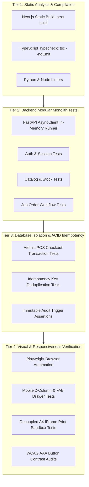

# MotoShop POS: Verification, Automated Testing & QA Specification
## Document ID: SPEC-006 | Version: 1.0.0-PROD | Status: READY

---

## 1. Testing Philosophy & Verification Strategy

The MotoShop POS verification framework guarantees enterprise reliability, ACID transaction integrity, and zero unexpected AWS cloud costs. 

Because the target deployment operates within the **AWS Always Free Tier ($0.00 / month)**, the testing architecture enforces two paramount invariants:
1. **Zero-Cloud-Cost CI/CD Testing**: 100% of automated unit, integration, and build tests execute inside GitHub Actions runners and ephemeral local containers without invoking paid cloud APIs.
2. **Zero Repository Artifact Pollution**: No test logs, screenshots, trace recordings, or build artifacts may pollute the git repository tree.

---

## 2. 4-Tier Automated Testing Architecture



---

## 3. Tier Specifications & Test Suites

### 3.1 Tier 1: Static Code Quality & Production Build Verification
Ensures zero runtime JavaScript errors and verifies that all 29 routes compile as static SPA artifacts:
* **Frontend Verification Command**:
  ```bash
  cd frontend && npm run build
  ```
* **Success Criteria**:
  - Exit code `0`.
  - All pages pre-rendered as `○ (Static)` or `● (SSG)` with fallback hydration parameters.
  - Zero unhandled dynamic server usage or missing asset imports.

### 3.2 Tier 2: Backend Modular Monolith Integration Tests (`backend/tests/`)
Verifies domain modules directly in memory via `httpx.AsyncClient` with `ASGITransport(app=app)` without requiring network socket overhead:
* **Execution Command**:
  ```bash
  cd backend && pytest tests/test_modular_monolith.py -v
  ```
* **Core Assertions**:
  1. `/api/v1/health` returns `200 OK` with service identifier `motoshop-modular-monolith`.
  2. `/api/v1/auth/seed-admin` seeds default root credentials safely and idempotently.
  3. `/api/v1/auth/login` sets `HttpOnly` refresh cookie and returns JWT with role claims.
  4. `/api/v1/inventory/items` validates SKU uniqueness and stock levels.
  5. `/api/v1/repairs/jobs` manages motorcycle status progressions.

### 3.3 Tier 3: Database Isolation & ACID Idempotency Suite
Validates that sales checkout executes as a single atomic unit of work and deduplicates network retries:
* **Idempotency Assertions**:
  - Sending request #1 with `Idempotency-Key: <UUID>` yields `201 Created` with invoice `INV-XXXXXX`, deducts stock from `20` to `18`, and links commission.
  - Resending request #2 with identical `Idempotency-Key` yields exact same `201 Created` and identical invoice number.
  - **Stock Isolation Assertion**: Item stock remains strictly `18` (not deducted twice).
* **Rollback Assertions**:
  - An intentional constraint violation (e.g. purchasing `9999` units when stock is `5`) rolls back all changes, leaving transaction tables, payments, and stock movements unaltered.

### 3.4 Tier 4: Browser Interaction & Visual Verification
Driven by Playwright to validate end-to-end user flows across desktop and mobile viewports:
* **Mobile POS Invariant**: Viewport width `390px` (iPhone 14) renders active repair cards and product catalog in a responsive 2-column grid (`grid-cols-2`).
* **Floating Filter FAB**: Verifies `FloatingFilterFab` renders directly above the cart FAB and opens the filter drawer.
* **Print Sandbox Isolation**: Verifies in-app invoice view retains dark mode styling, and printing triggers `printIsolatedDocument` within an ephemeral iframe containing a pure `#ffffff` canvas.
* **WCAG AAA Text Contrast Invariant**: Validates lime green buttons (`bg-lime-500`) carry `#09090b` dark carbon text for a contrast ratio $> 12:1$.

---

## 4. Zero-Cost Quota Envelope Verification Model

The test harness enforces mathematical boundaries to prove that the production system cannot exceed AWS Free Tier allowances:

| Resource | AWS Free Tier Quota | Monthly Shop Traffic Envelope | Utilization % | Safety Factor |
|---|---|---|---|---|
| **Lambda Requests** | 1,000,000 reqs/mo | ~25,000 reqs/mo | 2.50% | 40x headroom |
| **Lambda Compute** | 3,200,000 sec/mo | ~7,500 sec/mo (256MB @ 300ms) | 0.23% | 426x headroom |
| **CloudFront Transfer**| 1,000 GB/mo | ~3.0 GB/mo | 0.30% | 333x headroom |
| **S3 Storage** | 5,120 MB | ~80 MB static bundle | 1.56% | 64x headroom |
| **RDS PostgreSQL** | 750 hrs/mo `db.t4g.micro` | 744 hrs/mo (1 continuous node) | 99.2% | Always within 750h limit |

---

## 5. Zero Repository Artifact Pollution Guard

All visual testing agents and test suites must strictly adhere to the following file output protocol:
1. **Targeting Temporary Directories**:
   All screenshots, trace recordings, and video captures must be stored in `process.env.ARTIFACTS_DIR` or system temporary directory (`os.tmpdir()`), e.g.:
   ```typescript
   const screenshotPath = path.join(process.env.ARTIFACTS_DIR || os.tmpdir(), `test-${Date.now()}.png`);
   await page.screenshot({ path: screenshotPath });
   ```
2. **Playwright MCP Relocation**:
   Any `.png` captures generated inside `.playwright-mcp/` or root workspace must immediately be relocated to the artifacts directory and `.playwright-mcp` recursively deleted.
3. **Clean Git Working Tree Invariant**:
   Executing `git status --porcelain` after test execution must yield zero untracked `.png`, `.webm`, or `.log` files.
