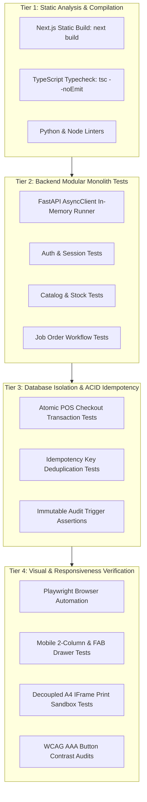

# MotoShop POS: Verification, Automated Testing & QA Specification
## Document ID: SPEC-006 | Version: 1.0.0-PROD | Status: READY

---

## 1. Testing Philosophy & Verification Strategy

The MotoShop POS verification framework guarantees enterprise reliability, ACID transaction integrity, and zero unexpected AWS cloud costs. 

Because the target deployment operates within the **AWS Always Free Tier ($0.00 / month)**, the testing architecture enforces two paramount invariants:
1. **Zero-Cloud-Cost CI/CD Testing**: 100% of automated unit, integration, and build tests execute inside GitHub Actions runners and ephemeral local containers without invoking paid cloud APIs.
2. **Zero Repository Artifact Pollution**: No test logs, screenshots, trace recordings, or build artifacts may pollute the git repository tree.

---

## 2. 4-Tier Automated Testing Architecture


```mermaid
flowchart TD
    subgraph Tier1 [Tier 1: Static Analysis & Compilation]
        T1_Build[Next.js Static Build: next build]
        T1_Types[TypeScript Typecheck: tsc --noEmit]
        T1_Lint[Python & Node Linters]
    end

    subgraph Tier2 [Tier 2: Backend Modular Monolith Tests]
        T2_ASGI[FastAPI AsyncClient In-Memory Runner]
        T2_Auth[Auth & Session Tests]
        T2_Inventory[Catalog & Stock Tests]
        T2_Repairs[Job Order Workflow Tests]
    end

    subgraph Tier3 [Tier 3: Database Isolation & ACID Idempotency]
        T3_Tx[Atomic POS Checkout Transaction Tests]
        T3_Lock[Idempotency Key Deduplication Tests]
        T3_Audit[Immutable Audit Trigger Assertions]
    end

    subgraph Tier4 [Tier 4: Visual & Responsiveness Verification]
        T4_Playwright[Playwright Browser Automation]
        T4_Mobile[Mobile 2-Column & FAB Drawer Tests]
        T4_Print[Decoupled A4 IFrame Print Sandbox Tests]
        T4_WCAG[WCAG AAA Button Contrast Audits]
    end

    Tier1 --> Tier2 --> Tier3 --> Tier4
```

---

## 3. Tier Specifications & Test Suites

### 3.1 Tier 1: Static Code Quality & Production Build Verification
Ensures zero runtime JavaScript errors and verifies that all 29 routes compile as static SPA artifacts:
* **Frontend Verification Command**:
  ```bash
  cd frontend && npm run build
  ```
* **Success Criteria**:
  - Exit code `0`.
  - All pages pre-rendered as `○ (Static)` or `● (SSG)` with fallback hydration parameters.
  - Zero unhandled dynamic server usage or missing asset imports.

### 3.2 Tier 2: Backend Domain Integration Suite (43 Tests)
Verifies domain modules against live PostgreSQL 16 schemas with an isolated connection pool lifecycle via `backend/tests/conftest.py`:
* **Execution Commands**:
  ```bash
  npm run test:backend
  # Or: docker exec motoshop-backend pytest -v
  ```
* **Domain Test Coverage**:
  1. **Authentication & Session Lifecycle** (`test_auth.py` — 9 tests): Admin seeding, credential verification, invalid passwords, non-existent accounts, HttpOnly refresh cookie rotation, staff registration, duplicate email rejection (409), profile patching, staff directory listing.
  2. **Catalog & Inventory** (`test_inventory.py` — 8 tests): Product item creation, service item creation, entity retrieval by UUID, 404 on missing item, price/stock atomic updates, soft/hard deletion, category filtering (`PRODUCT` vs `SERVICE`).
  3. **Repairs & Workshop Jobs** (`test_repairs.py` — 6 tests): Job order creation with JO numbering, job listing, status lifecycle progression (`PENDING` $\to$ `ONGOING` $\to$ `COMPLETED`), unpaid release guard rejection (HTTP 400 when attempting to mark as `RELEASED` without payment), motorcycle profiles, repair cart line items.
  4. **Sales & ACID POS Checkout** (`test_sales.py` — 5 tests): Atomic POS checkout with inventory stock deduction and audit logging, Idempotency-Key replay defense, multi-item cart with percentage discount, transaction lookup by invoice/UUID, void transaction safeguard.
  5. **Audit Logs & CSV Export** (`test_audit.py` — 4 tests): Ingesting client-side audit actions, paginated log retrieval, action filtering, RFC 4180 CSV export with UTF-8 BOM.
  6. **RBAC Security Boundaries** (`test_rbac_security.py` — 7 tests): Unauthenticated requests rejected (401), tampered bearer tokens rejected (401), Cashier forbidden from staff user creation (403), Cashier forbidden from audit log viewing (403), Mechanic forbidden from POS checkout (403), Mechanic forbidden from inventory creation (403), Admin full domain access.
  7. **Modular Monolith E2E** (`test_modular_monolith.py` — 4 tests): Monolith `/health` endpoint, seed & admin login, full end-to-end checkout with stock balance verification, profile editing with audit log ingestion.

### 3.3 Tier 3: Isolated Engine Pool Lifecycle & Connection Safety (`conftest.py`)
* **Engine Teardown Invariant**:
  ```python
  @pytest.fixture(autouse=True)
  async def cleanup_db_connections():
      yield
      await engine.dispose()
  ```
  Prevents asyncpg event loop detachment errors (`Future attached to a different loop`) by disposing SQLAlchemy's connection pool before pytest closes each test function's asyncio loop.
* **Role Fixtures**: Provides pre-authenticated headers (`admin_headers`, `cashier_headers`, `mechanic_headers`).

### 3.4 Tier 4: Pre-Flight Security Testing Gate (`npm run test:security`)
* **Frontend Dependency Audit**: `npm audit --audit-level=high` enforces zero vulnerabilities.
* **Python SAST**: `bandit -r backend/app/ -ll` enforces zero Medium and High severity code vulnerabilities.
* **Dependency CVE Auditing**: `pip-audit -r backend/requirements.txt` validates Python packages against PyPA advisories.
* **Secret Scanning**: Gitleaks enforces zero credential leakage against `.gitleaks.toml`.

### 3.5 Tier 5: Browser Interaction, Mobile Usability & Visual Verification (40 Playwright Tests)
Driven by Playwright (`npm run test:e2e`) across desktop (1440×900), tablet (768×1024), and mobile (375×812 / 390×844) viewports:
* **Mobile POS Invariant**: Viewport width `375px` renders active repair cards and catalog in a responsive 2-column grid (`grid-cols-2`).
* **Unified Floating Action Buttons (FAB)**: Validates 56×56px emerald Add FAB and Filter FAB portaled to `document.body` with safe-area insets (`env(safe-area-inset-bottom)`).
* **Destructive Action Safeguards**: Danger `ConfirmModal` gating sales voiding and entity deletions.
* **Print Sandbox Isolation**: In-app invoice view retains dark mode styling; printing triggers `printIsolatedDocument` within an ephemeral iframe containing a pure `#ffffff` canvas.
* **WCAG AAA Text Contrast Invariant**: Validates lime green buttons (`bg-lime-500`) carry `#09090b` dark carbon text for a contrast ratio $> 12:1$.

---

## 4. Zero-Cost Quota Envelope Verification Model

The test harness enforces mathematical boundaries to prove that the production system cannot exceed AWS Free Tier allowances:

| Resource | AWS Free Tier Quota | Monthly Shop Traffic Envelope | Utilization % | Safety Factor |
|---|---|---|---|---|
| **Lambda Requests** | 1,000,000 reqs/mo | ~25,000 reqs/mo | 2.50% | 40x headroom |
| **Lambda Compute** | 3,200,000 sec/mo | ~7,500 sec/mo (256MB @ 300ms) | 0.23% | 426x headroom |
| **CloudFront Transfer**| 1,000 GB/mo | ~3.0 GB/mo | 0.30% | 333x headroom |
| **S3 Storage** | 5,120 MB | ~80 MB static bundle | 1.56% | 64x headroom |
| **RDS PostgreSQL** | 750 hrs/mo `db.t4g.micro` | 744 hrs/mo (1 continuous node) | 99.2% | Always within 750h limit |

---

## 5. Zero Repository Artifact Pollution Guard

All visual testing agents and test suites must strictly adhere to the following file output protocol:
1. **Targeting Temporary Directories**:
   All screenshots, trace recordings, and video captures must be stored in `process.env.ARTIFACTS_DIR` or system temporary directory (`os.tmpdir()`), e.g.:
   ```typescript
   const screenshotPath = path.join(process.env.ARTIFACTS_DIR || os.tmpdir(), `test-${Date.now()}.png`);
   await page.screenshot({ path: screenshotPath });
   ```
2. **Playwright MCP Relocation**:
   Any `.png` captures generated inside `.playwright-mcp/` or root workspace must immediately be relocated to the artifacts directory and `.playwright-mcp` recursively deleted.
3. **Clean Git Working Tree Invariant**:
   Executing `git status --porcelain` after test execution must yield zero untracked `.png`, `.webm`, or `.log` files.
